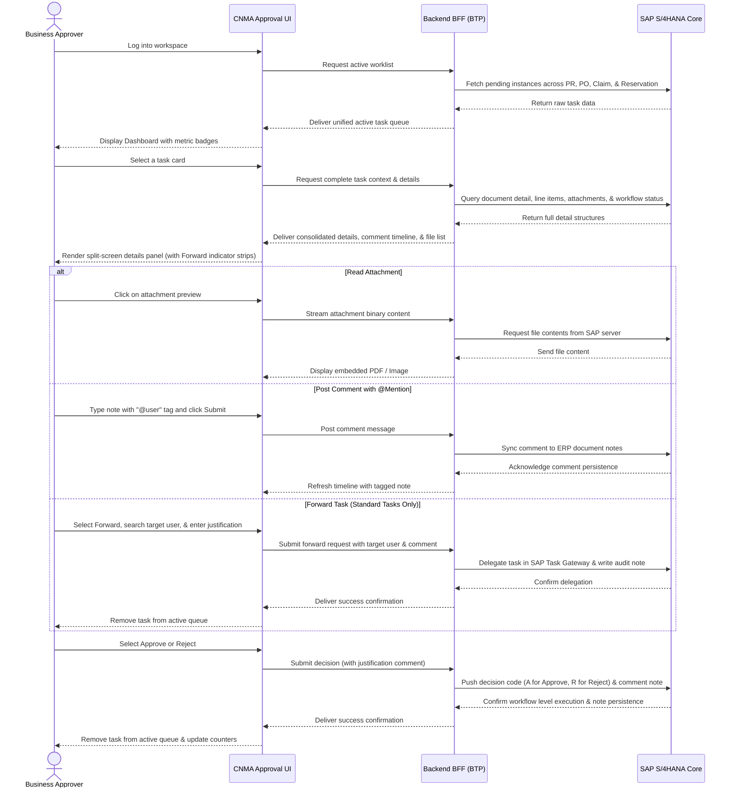
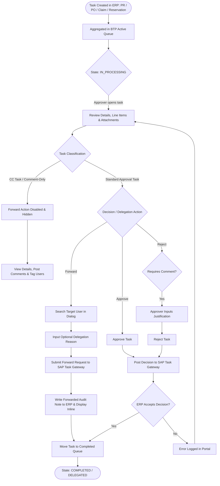
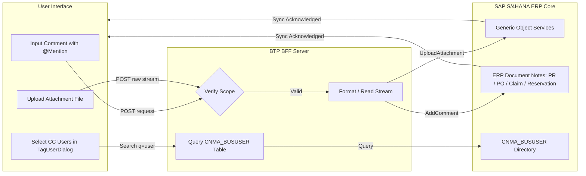

# Business Process Flows

> **Owner:** Lead Business Analyst | **Last Updated:** 2026-08-27 | **Status:** Active

This document maps out the operational and lifecycle processes governing the **CNMA Approval** portal. The diagrams below illustrate how data flows and how actions transition across system boundaries for all supported business object types: **Purchase Requisitions (PR)**, **Purchase Orders (PO)**, **Expense Claims (CLAIM)**, and **Material Reservations (RE)**.

---

## 1. End-to-End User Journey Flow

The sequence diagram below outlines a business user's journey through the unified approval interface, from logging into the portal to completing an approval decision or forwarding a task:

---

## 2. Decision-Making & Delegation Lifecycle Flow

This flowchart maps the lifecycle states of a workflow task, including CC task action restrictions, forwarding, and completion:

---

## 3. Collaboration & Synchronization Flow

Comments, `@mentions`, CC tags, and attachments are synced directly back to S/4HANA to maintain audit integrity across procurement and financial documents:

