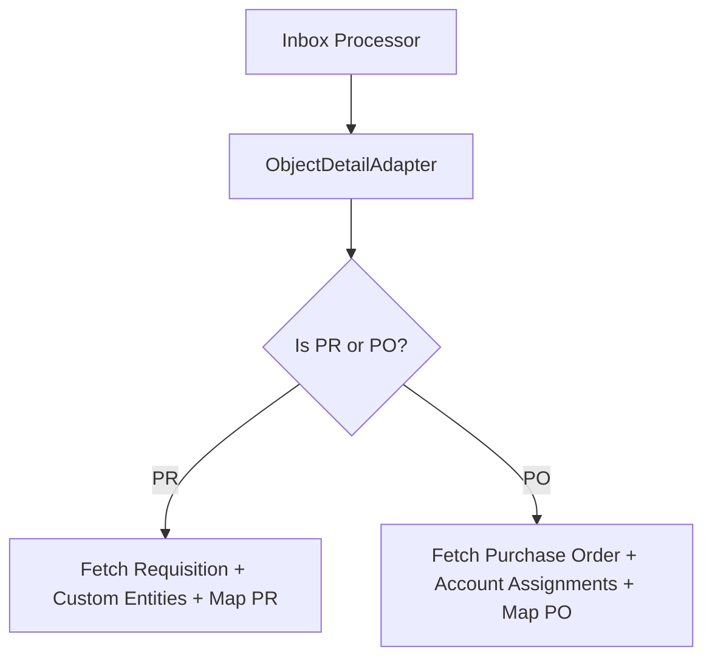
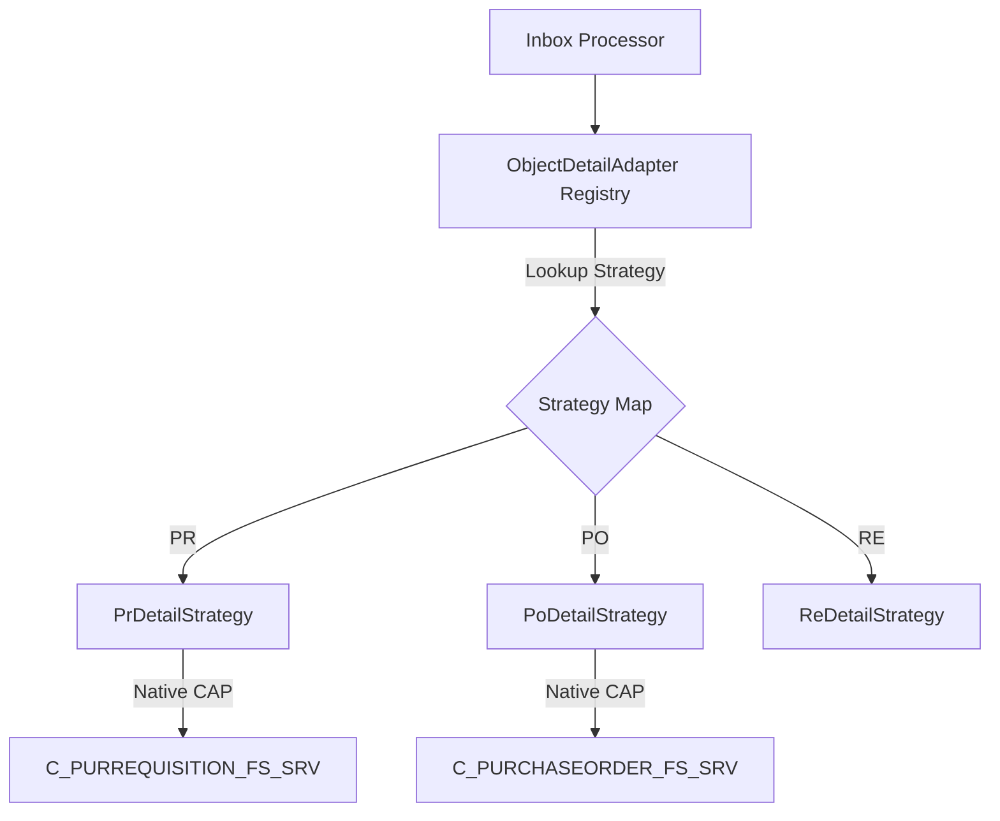
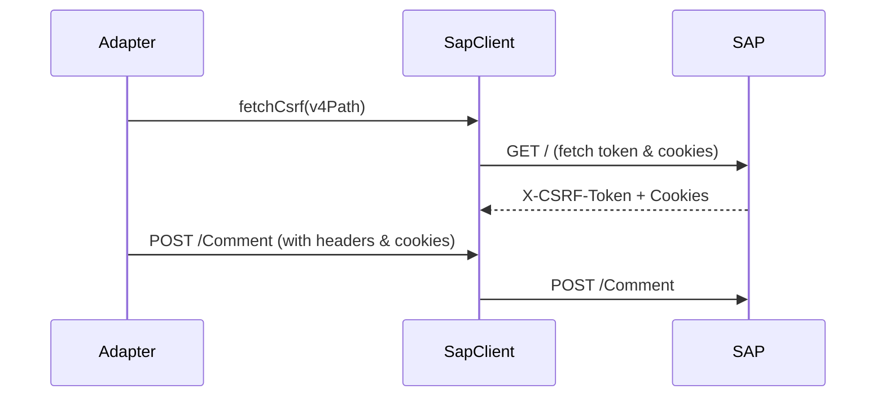
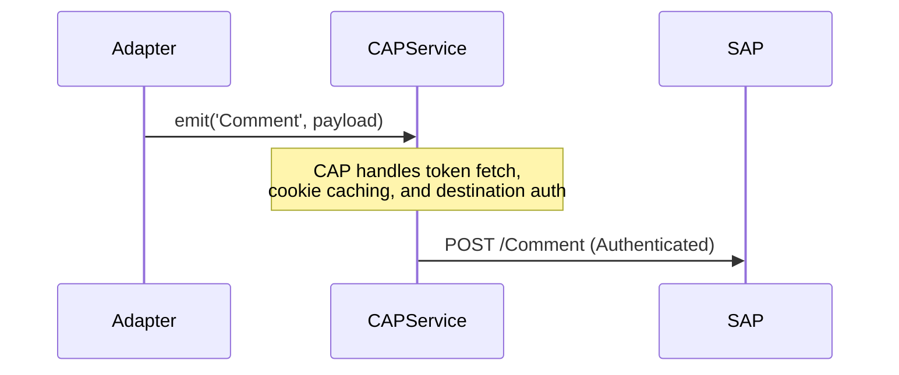

# Code Review Report

**Date:** 260709
**Reviewer:** Leo – AI + 4-Eyes
**Scope:** [srv/lib/integrations/object-detail-adapter.ts](file:///d:/learning/test/cnma_approval/srv/lib/integrations/object-detail-adapter.ts), [srv/lib/integrations/instance-list-adapter.ts](file:///d:/learning/test/cnma_approval/srv/lib/integrations/instance-list-adapter.ts), [srv/lib/processors/odata-config.ts](file:///d:/learning/test/cnma_approval/srv/lib/processors/odata-config.ts)

---

## Code Score

**Overall: 65 / 100**

> *The code implements batching to avoid N+1 queries and includes a caching layer, but heavily violates SOLID principles (SRP/OCP), manually handles HTTP/CSRF headers instead of using CAP remote services, and hardcodes integration endpoints.*

---

## Business Impact Assessment

1. **Maintainability Cost:** Adding new document types (e.g., Reservation `RE` or Claim `CLAIM`) requires modification of core adapter logic, which increases the likelihood of regression bugs for existing objects (`PR`, `PO`).
2. **Stability Risk:** Hardcoding SAP paths and manually manipulating CSRF tokens, cookies, and batch payload requests via a custom HTTP wrapper (`SapClient`) bypasses CAP's native security capabilities, which could lead to authentication failures during Principal Propagation on SAP BTP.
3. **Data Robustness:** The assumptions around ID padding (`padStart(10, '0')`) can fail or corrupt data for alphanumeric or external document identifiers.

---

## Actionable Findings

### 🔴 CRITICAL — Must fix before shipping

| # | Location | Issue | Recommendation |
|---|---|---|---|
| C1 | `ObjectDetailAdapter._getDetailInternal` (lines 192–424) | **OCP Violation:** Hardcoded conditional branches for `PR` and `PO` handle specific fetching, batch requests, and custom mapping. | Refactor using the **Strategy Pattern**. Create `PrDetailStrategy` and `PoDetailStrategy` classes, registering them in a Strategy Registry. |
| C2 | `ObjectDetailAdapter` (lines 86, 134, 232, 377, 434) | **Hardcoded SAP Paths:** Service paths, entity sets, and action triggers are hardcoded directly in the logic rather than using configuration. | Move all endpoint strings to `odata-config.ts` or bind them to native CAP external service configurations in `package.json`. |

### 🟡 WARNING — Tech debt / design issues

| # | Location | Issue | Recommendation |
|---|---|---|---|
| W1 | `ObjectDetailAdapter` (lines 24, 27) and `InstanceListAdapter` (line 6) | **DRY / DI Violation:** `sapClient` is instantiated multiple times. Also, `MetadataService` instantiates its own copy. | Use dependency injection to share a single `SapClient` instance, or migrate to CAP's native `cds.connect.to` mechanism. |
| W2 | `ObjectDetailAdapter.addComment` & `uploadAttachment` (lines 426–497) | **Manual CSRF/Cookie Handling:** The adapter manually executes CSRF token fetches and cookie injection for POST requests. | Use CAP's native remote service clients (`cds.connect.to`), which handle CSRF tokens, destinations, and sessions automatically. |
| W3 | `ObjectDetailAdapter` (lines 88, 136, 231, 378, 435, 467, 504) | **Fragile ID Padding:** Assumption that all document IDs are numeric and must be 10 characters long (`padStart(10, '0')`). | Make padding length configurable per document type, or run padding only when the ID contains purely numeric characters. |

### 🔵 LOW — Nice-to-have improvements

| # | Location | Issue | Recommendation |
|---|---|---|---|
| L1 | `ObjectDetailAdapter.fetchAttachmentContent` (lines 521–546) | **Complex Utility Logic:** File content parsing (hex vs. base64 detection) is inline, complicating the adapter class. | Extract file type decoding logic to a separate helper file (e.g., `srv/lib/utils/file-helper.ts`). |
| L2 | `ObjectDetailAdapter._getDetailInternal` (lines 213–228) | **Silent Fallback to Mock Data:** Non-implemented types quietly fallback to mock data, masking integration gaps in dev. | Throw a clean `NotImplementedError` or return an empty structure so that developers notice missing integration points. |

---

## Finding Details

### C1 — Open/Closed Principle Violation in Detail Retrieval

**Class / Function:** `ObjectDetailAdapter._getDetailInternal` and `getDetailBatch`

**Detail:** The method `_getDetailInternal` serves as a master handler that inspects the `objectType` and branches. Each branch carries out query orchestration (fetching from standard paths, resolving V4 relations, sorting, mapping) which is highly specific. When new objects (e.g. `RE` or `CLAIM`) are introduced, this file must grow, creating regression risk on tested `PR`/`PO` flows.

**Before flow → Optimised flow**

→

---

### W2 — Manual CSRF and Cookie Management

**Class / Function:** `ObjectDetailAdapter.addComment` and `ObjectDetailAdapter.uploadAttachment`

**Detail:** Both functions execute a manual CSRF token fetch (`sapClient.fetchCsrf`) and copy cookies back and forth in headers. Doing so is brittle and requires the custom client to maintain state. In a production cluster with multiple app instances, this manual state tracking can cause authentication mismatches.

**Before flow → Optimised flow**

→

---

## Principles Summary

| Principle | Status | Notes |
|---|---|---|
| SOLID | ❌ Fail | Fails on Single Responsibility (SRP) and Open/Closed (OCP) due to hardcoded, branch-heavy entity mappings inside `ObjectDetailAdapter`. |
| DRY | ⚠️ Improve | `sapClient` is initialized in multiple places, and header mapping has overlapping camelCase normalization functions. |
| YAGNI | ⚠️ Improve | The fallback logic in `_getDetailInternal` silently routes unregistered types to mock details, masking unfinished integration scope. |
| KISS | ✅ Pass | Individual mapping properties and array logic are kept simple and readable, avoiding complex data transformation libraries. |
