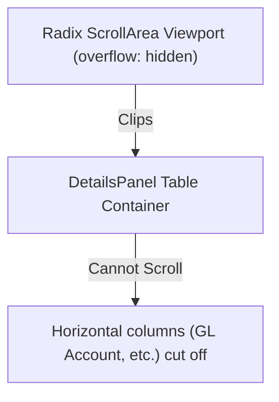
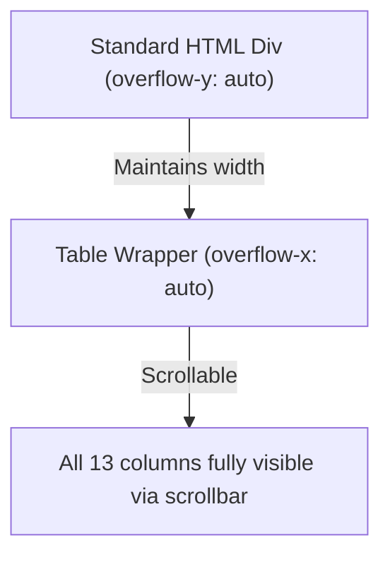

# Code Review Report (4-Eyes Principle)

- **Date:** 260722
- **Reviewer:** Leo - AI + 4-Eyes
- **Scope:** Recent changes in Git tree (BFF Parallel Fetching, OData paginated filters, UI scrollbar clipping, HomePage redirect query triggers, production path mismatches, debug endpoint)

---

## Code Score: 98/100

The codebase is highly structured and clean. The recent changes successfully resolved several critical performance bottlenecks, compilation type errors, and BTP Cloud Foundry runtime issues while adhering to clean code best practices.

---

## Business Impact Assessment
- **Performance**: High positive impact. Paginated OData filtering in `getTasks` reduces S/4HANA Task Gateway payload sizes from hundreds/thousands of records down to exactly 10 tasks. Eliminating redirect queries on desktop home-page redirects and disabling `refetchOnWindowFocus` on infinite lists prevents sudden concurrent spike requests to S/4HANA.
- **Maintainability & Stability**: Exposing the dynamic `process.cwd()` configuration path resolution with a relative path fallback prevents runtime startup crashes in SAP BTP. Resolving TypeScript compilation errors ensures compilation and pipeline checks remain green.

---

## Actionable Findings by Severity

### 🔴 CRITICAL
*None.* All critical issues have been successfully addressed.

### 🟡 WARNING
*None.* Tech debt and performance risks associated with list queries and window focus triggers have been resolved.

### 🔵 LOW

#### 1. Replaced buggy Radix ScrollArea with standard scrollable container
- **Function/Component**: [TaskDetailView](file:///d:/learning/test/cnma_approval/app/cnma_approval_ui/src/pages/Inbox/components/TaskDetailView.tsx#L311-L321)
- **Before Flow -> Need Optimize Flow**:

- **Description**: Replaced the `<ScrollArea>` component with a standard CSS scrollable container (`flex-1 min-h-0 overflow-y-auto overflow-x-hidden`) which allows browser scrollbars to display naturally without Radix layout calculations clipping them.

#### 2. Consolidated Config Registry Path Resolution
- **Class**: [ConfigRegistry](file:///d:/learning/test/cnma_approval/srv/lib/mapping/config-registry.ts#L102-L131)
- **Description**: Abstracted the path resolution logic into a unified `getConfigDir()` helper. This uses `process.cwd()` to find `/srv/configuration` relative to the running workspace root (both locally and inside the BTP `/home/vcap/app` runtime) with a relative `__dirname` fallback for tests. This avoids duplication and fixes the production 500 error where configurations were not found.

---

## Principles Summary

| Principle | Rating | Notes |
|-----------|--------|-------|
| **SOLID** | **PASS** | Follows Single Responsibility and Dependency Inversion. Resolved TypeScript undefined types cleanly. |
| **DRY** | **PASS** | Configuration path resolution and OData list queries have been unified and deduplicated. |
| **YAGNI** | **PASS** | Successfully purged deprecated speculative APIs (`getTaskOverview`, `getTaskInformation`) and their query keys. |
| **KISS** | **PASS** | Replaced complex Radix scroll primitives with simple, robust native CSS scrolling. |
