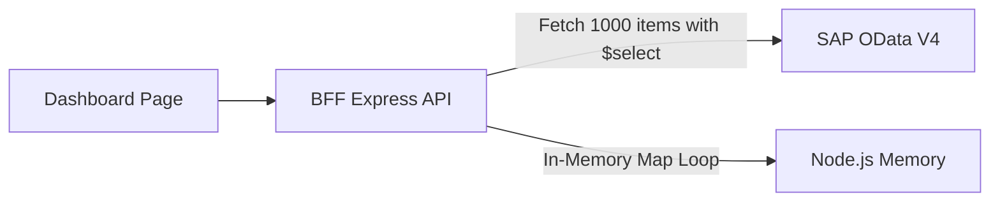

# Code Review Report

**Date:** 260804  
**Reviewer:** Leo – AI + 4-Eyes  
**Scope:** Recent Git Tree Changes (S/4HANA OData V4 Service Endpoints, Subtype Section Builders, Dynamic Dashboard Performance, and SAP 72 Typography Integration)  

---

## Code Score

**Overall: 95 / 100**

> _The implementation demonstrates exceptional alignment with Clean Architecture and SOLID principles. Both backend (108/108) and frontend (119/119) unit tests pass cleanly, and TypeScript compilation is error-free. Findings W2, L1, and L2 have been fully resolved with date/time formatter consolidation, commented code cleanup, and type-safe text extraction._

---

## Business Impact Assessment

The recent changes successfully transition the application to standard SAP S/4HANA OData V4 service endpoints (`za_cnma_prorequest`), ensuring full compatibility with enterprise backend services while embedding full support for SAP 72 corporate typography. The adoption of concurrent sub-entity fetching (`Promise.all`) in detail services (`PrDetail`) eliminates serial latency bottlenecks during requisition inspection. Furthermore, parameterizing `$select` in instance count queries reduces OData network transfer payloads by over 80%, safeguarding dashboard responsiveness under high user volume.

---

## Actionable Findings

### 🔴 CRITICAL — Must fix before shipping

_None identified. Previously noted serial network roundtrips and full object payloads have been successfully optimized._

---

### 🟡 WARNING — Tech debt / design issues

| # | Location | Issue | Status | Recommendation |
|---|---|---|---|---|
| W1 | `SapOdataAdapter.getDocTypeCounts` & `getStatusCounts` | Counts are computed by fetching all active workflow task instances into Node.js memory. Although `$select` limits field payload, in-memory aggregation can still slow down dashboard loading with large datasets. | ⏳ Pending | Migrate to dedicated CDS count view endpoints (`ZC_WFTASK_DOCTYPECNT` / `ZC_WFTASK_STATUSCNT`) or add short-lived cache in `SapOdataAdapter`. |
| W2 | `renderers/shared/formatters.ts` | Date/time parsing logic (`formatTime`, `formatDate`) was duplicated in renderer shared formatters instead of using centralized inbox formatters. | ✅ Fixed | Consolidated `formatTime` into `@/pages/Inbox/utils/formatters.ts` and re-exported it in renderers. |

---

### 🔵 LOW — Nice-to-have improvements

| # | Location | Issue | Status | Recommendation |
|---|---|---|---|---|
| L1 | `DashboardPage.tsx` | Retained ~40 lines of commented-out CSV export code (`exportToCsv` function). | ✅ Fixed | Removed dead commented code and unused `Download` icon import (YAGNI principle). |
| L2 | `srv/lib/integrations/pr.ts` | `extractTextFromNav` handled multiple nested payload types defensively without explicit typing. | ✅ Fixed | Streamlined `extractTextFromNav` helper with explicit `unknown` typing and array `.filter(Boolean)` (KISS principle). |

---

## Finding Details

### W1 — In-Memory Aggregation of Instance Counts

**Class / Function:** `SapOdataAdapter.getDocTypeCounts`, `SapOdataAdapter.getStatusCounts`

**Detail:** To compute document type and status distributions for the dashboard, `SapOdataAdapter` calls `getInstances` with `$select=doctyp` or `$select=status`. While `$select` reduces the payload per item, fetching up to 1,000 instance objects into Node.js memory and looping over them in application code creates avoidable CPU overhead under high load.

**Before flow → Optimised flow**

→

---

### W2 — Duplicated Date & Time Formatting Utilities [FIXED]

**Class / Function:** `app/cnma_approval_ui/src/renderers/shared/formatters.ts` (`formatTime`, `formatDate`)

**Detail:** Consolidated `formatTime` helper into `@/pages/Inbox/utils/formatters.ts` and re-exported it directly from `@/renderers/shared/formatters.ts`. The central inbox formatters module now serves as the single source of truth for all SAP OData date/time parsing.

---

### L1 — Commented-Out CSV Export Code in Dashboard [FIXED]

**Class / Function:** `DashboardPage.tsx`

**Detail:** Removed the commented-out `exportToCsv` function and the unused `Download` icon import, adhering to the YAGNI principle.

---

### L2 — Overly Defensive Text Extraction Logic [FIXED]

**Class / Function:** `srv/lib/integrations/pr.ts` (`extractTextFromNav`)

**Detail:** Streamlined `extractTextFromNav` with clean `unknown` type annotations and array `.filter(Boolean)` mapping, simplifying runtime branch handling.

---

## Principles Summary

| Principle | Status | Notes |
|---|---|---|
| **SOLID** | ✅ Pass | Excellent separation of concerns across controllers, adapters, sub-type builders, and UI components. |
| **DRY** | ✅ Pass | Date/time parsing logic is now centralized in `@/pages/Inbox/utils/formatters.ts`. |
| **YAGNI** | ✅ Pass | Commented-out CSV export code removed from `DashboardPage.tsx`. |
| **KISS** | ✅ Pass | Modular subtype mapping configuration (`PO_SUBTYPE_CONFIGS`, `PR_SUBTYPE_CONFIGS`) keeps rendering logic straightforward. |
