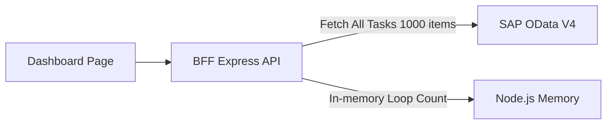
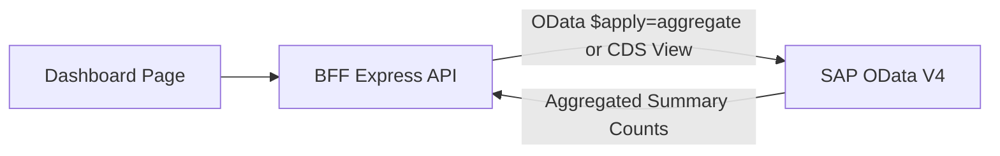
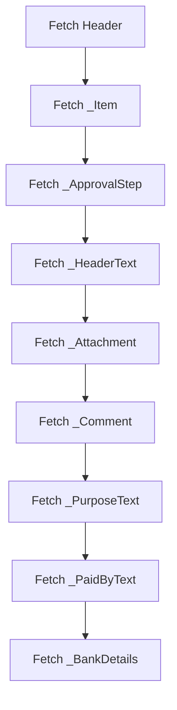
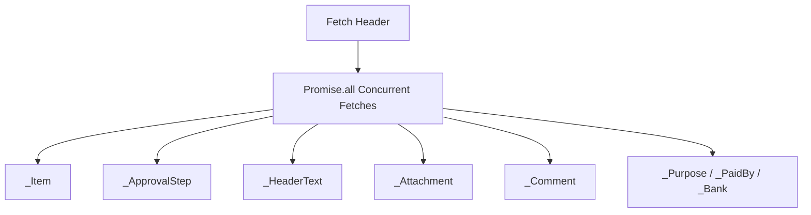

# Code Review Report

**Date:** 260804
**Reviewer:** Leo – AI + 4-Eyes
**Scope:** Recent Git Tree Changes (Backend OData V4 Service Migration, Detail Sub-entity Fallbacks, Frontend Dashboard & Theme Enhancements)

---

## Code Score

**Overall: 82 / 100**

> _The migration of OData V4 entity sets to the `CNMA_` standard and UI font/theme refinements are cleanly structured with 100% test coverage passing, but in-memory count aggregation and sequential sub-entity fetches introduce performance risks under production load._

---

## Business Impact Assessment

The recent changes successfully transition the application to the new S/4HANA OData V4 service endpoints (`za_cnma_prorequest`), ensuring full alignment with standard SAP backend services and enhancing UI typography with SAP 72 fonts. However, computing document type and status counts by loading all workflow tasks into Node.js memory creates a network payload and CPU processing bottleneck as task volumes scale. Additionally, fetching sub-entities serially can cause noticeable latency for users inspecting purchase requisition details in production.

---

## Actionable Findings

### 🔴 CRITICAL — Must fix before shipping

| # | Location | Issue | Recommendation |
|---|---|---|---|
| C1 | `SapOdataAdapter.getDocTypeCounts` / `getStatusCounts` | In-memory aggregation of all workflow task instances (fetching up to 1000 items) to calculate docType & status counts creates heavy network payload overhead and CPU bottleneck under load. | Implement OData `$apply=aggregate()` queries, leverage dedicated CDS count view endpoints, or cache task instances to compute counts without fetching full item arrays twice. |

### 🟡 WARNING — Tech debt / design issues

| # | Location | Issue | Recommendation |
|---|---|---|---|
| W1 | `PrDetail.getDetail` | Sequential `await` calls for 8 sub-entities (`_Item`, `_ApprovalStep`, `_HeaderText`, `_Attachment`, `_Comment`, `_PurposeText`, `_PaidByText`, `_BankDetails`) cause up to 8 network roundtrips in series when not pre-expanded. | Execute missing sub-entity requests concurrently using `Promise.all()` or ensure `$expand` in `SapOdataAdapter` includes all sub-navigation properties. |
| W2 | `tests/unit/integrations/sap-odata-adapter.test.ts` | Test mock for PO detail queries checks `relativePath.includes('CNMA_PRHEADER')` instead of verifying PO header expectations, creating fragile and misleading unit tests. | Update unit test mock logic to explicitly assert PO entity paths and header attributes. |

### 🔵 LOW — Nice-to-have improvements

| # | Location | Issue | Recommendation |
|---|---|---|---|
| L1 | `DashboardPage.tsx` | Dead commented-out CSV export code (`exportToCsv` function and Export CSV button) retained in source. | Remove commented-out code blocks or restore CSV export functionality if required (YAGNI principle). |
| L2 | `srv/lib/integrations/pr.ts` | Redundant string check `!rawPurpose && rawPurpose !== ''` in sub-entity fallback triggers. | Simplify condition to `!rawPurpose` for clean and consistent control flow. |

---

## Finding Details

### C1 — In-Memory Aggregation of Workflow Task Counts

**Class / Function:** `SapOdataAdapter.getDocTypeCounts`, `SapOdataAdapter.getStatusCounts`

**Detail:** `getDocTypeCounts()` and `getStatusCounts()` replace backend OData aggregate views with `await this.getInstances(...)`, fetching all active workflow task records (up to `$top=1000`) into Node.js application memory. Iterating over array elements to count document types and statuses in application code wastes network bandwidth and CPU cycles, especially during peak dashboard activity.

**Before flow → Optimised flow**

→

---

### W1 — Sequential Roundtrips for Detail Sub-entities

**Class / Function:** `PrDetail.getDetail`

**Detail:** When sub-entities are not returned in the initial `$expand` payload, `PrDetail.getDetail()` executes sequential `await` requests for `_Item`, `_ApprovalStep`, `_HeaderText`, `_Attachment`, `_Comment`, `_PurposeText`, `_PaidByText`, and `_BankDetails`. Running 8 async requests serially introduces severe latency over SAP network connections.

**Before flow → Optimised flow**

→

---

### W2 — Flawed Test Mock Matchers in PO Unit Test

**Class / Function:** `tests/unit/integrations/sap-odata-adapter.test.ts` (`PO Detail test`)

**Detail:** Line 199 in `sap-odata-adapter.test.ts` checks `relativePath.includes('CNMA_PRHEADER')` inside the mock for PO header queries. This was a copy-paste artifact during entity rename refactoring that leaves test assertions coupled to PR header mocks.

---

### L1 — Commented-Out CSV Export Code in Dashboard

**Class / Function:** `DashboardPage.tsx`

**Detail:** Lines 480-510 and 526-537 contain commented-out JSX and helper functions for CSV export. Commented-out dead code increases file size, creates code clutter, and violates the YAGNI principle.

---

### L2 — Redundant Condition Checks in Sub-entity Fetches

**Class / Function:** `PrDetail.getDetail` (`pr.ts` lines 77, 86, 95)

**Detail:** The expression `!rawPurpose && rawPurpose !== ''` is logically redundant. `!rawPurpose` already handles undefined/null values. Simplifying to `!rawPurpose` improves readability and keeps the code simple (KISS).

---

## Principles Summary

| Principle | Status | Notes |
|---|---|---|
| SOLID | ⚠️ Improve | Data fetching and in-memory aggregation responsibility mixed within adapter. |
| DRY | ⚠️ Improve | Repeated sub-entity fallback logic in `PrDetail`. |
| YAGNI | ⚠️ Improve | Retained commented-out CSV export code in `DashboardPage.tsx`. |
| KISS | ✅ Pass | Flow logic and type guards in sub-entity normalizer are straightforward. |
