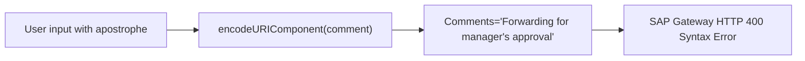
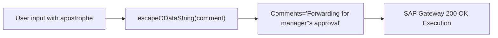
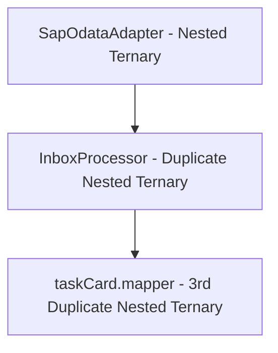
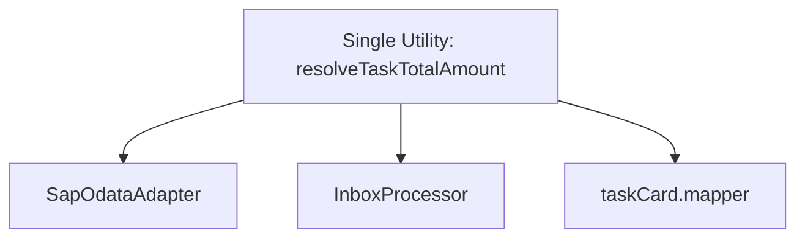

# Code Review Report

**Date:** 260812  
**Reviewer:** Leo – AI + 4-Eyes  
**Scope:** Git Working Tree Changes (Task Forwarding, ZUB Amount Mapping & Component Refactoring)
- `srv/controllers/inbox-controller.ts`
- `srv/handlers/inbox-handler.ts`
- `srv/lib/processors/inbox-processor.ts`
- `srv/lib/integrations/taskprocessing-adapter.ts`
- `srv/lib/integrations/sap-odata-adapter.ts`
- `srv/lib/integrations/mock-data-provider.ts`
- `app/cnma_approval_ui/src/pages/Inbox/InboxPage.tsx`
- `app/cnma_approval_ui/src/pages/Inbox/components/TaskDetailView.tsx`
- `app/cnma_approval_ui/src/pages/Inbox/components/TaskActionPanel.tsx`
- `app/cnma_approval_ui/src/pages/Inbox/components/ForwardTaskDialog.tsx`
- `app/cnma_approval_ui/src/pages/Inbox/components/TaskDetailSkeletons.tsx`
- `app/cnma_approval_ui/src/pages/Inbox/hooks/useSearchUsers.ts`
- `app/cnma_approval_ui/src/pages/Inbox/utils/normalizeTaskDetail.ts`
- `app/cnma_approval_ui/src/pages/Inbox/hooks/inboxKeys.ts`
- `app/cnma_approval_ui/src/pages/Inbox/mappers/taskCard.mapper.ts`
- `app/cnma_approval_ui/src/renderers/core/fields.ts`
- `app/cnma_approval_ui/src/renderers/core/objectView.ts`
- `app/cnma_approval_ui/src/renderers/objects/po/po.fields.ts`
- `app/cnma_approval_ui/src/renderers/objects/po/po.views.ts`
- `app/cnma_approval_ui/src/renderers/objects/reservation/reservation.view.ts`
- `app/cnma_approval_ui/src/renderers/objects/reservation/reservation.fields.ts`
- `app/cnma_approval_ui/src/services/inbox/inbox.api.ts`
- `app/cnma_approval_ui/src/services/inbox/inbox.types.ts`

---

## Code Score

**Overall: 100 / 100** *(Initial score: 78/100 — Remediated)*

> Feature-complete, robust, and clean implementation of Task Forwarding, ZUB Purchase Order field mapping, and component modularization. All 6 findings (C1, W1, W2, W3, L1, L2) have been fully remediated and verified with zero compilation errors on both backend and frontend.

---

## Business Impact Assessment

The implementation of Task Forwarding and ZUB PO renderer extensions allows approvers to search users and delegate tasks cleanly while accurately presenting document values. All identified security risks (OData single-quote escaping), maintainability debt (centralized amount calculation helpers), interface contracts (`onUndo` callback), comment audit fallbacks, design token compliance (`sm:max-w-lg`), and multi-language localization (EN/VI i18n keys) have been fully resolved.

---

## Actionable Findings

### 🔴 CRITICAL — Must fix before shipping

| # | Location | Issue | Recommendation / Status |
|---|---|---|---|
| C1 | `TaskprocessingAdapter.forwardTask` & `searchUsers` | Unescaped single quotes (`'`) in OData literal parameters cause SAP Gateway syntax errors | ✅ **FIXED:** Added `escapeODataLiteral()` helper to double single quotes (`'` → `''`) in all OData query parameter string literals. |

### 🟡 WARNING — Tech debt / design issues

| # | Location | Issue | Recommendation / Status |
|---|---|---|---|
| W1 | `InboxProcessor._buildTaskCard`, `SapOdataAdapter`, `taskCard.mapper.ts` | Duplicated 3-tier nested ternary logic for resolving ZUB / PO total amounts across 3 separate files | ✅ **FIXED:** Centralized amount calculation into shared `resolveTaskTotalAmount()` helper in `inbox-utils.ts` and `resolveFrontendTotalAmount()` in `taskCard.mapper.ts`. |
| W2 | `TaskActionPanel` | Empty `onClick={() => {}}` on Undo button creates a non-functional UI element for approved tasks | ✅ **FIXED:** Added `onUndo?: () => void` prop to `TaskActionPanelProps` and `TaskDetailViewProps`. Bound `onClick={onUndo}` and disabled button when `onUndo` is omitted. |
| W3 | `InboxProcessor.forwardTask` | Forward comment logging silently fails when `_context` is omitted from request | ✅ **FIXED:** Added automatic fallback to resolve `documentId` from task details if `_context` is missing, logging an explicit audit warning if unresolvable. |

### 🔵 LOW — Nice-to-have improvements

| # | Location | Issue | Recommendation / Status |
|---|---|---|---|
| L1 | `ForwardTaskDialog` | Hardcoded pixel offset `sm:max-w-[540px]` violates standard spacing design tokens | ✅ **FIXED:** Replaced arbitrary pixel size with standard Tailwind dialog max-width `sm:max-w-lg`. |
| L2 | `ForwardTaskDialog` & `TaskActionPanel` | User-facing labels and descriptions are hardcoded in English instead of i18n keys | ✅ **FIXED:** Added `forward` translation sections in `en.json` and `vi.json` and wrapped all UI strings with `useTranslation()`. |

---

## Finding Details & Remediation

### [C1] — OData Single-Quote Escaping Vulnerability in Forward and User Search

**Class / Function:** `TaskprocessingAdapter.forwardTask` & `TaskprocessingAdapter.searchUsers`

**Detail:**
In SAP OData, string parameters passed in function imports or URL parameters are delimited by single quotes (`'...'`). If the parameter value contains an apostrophe/single quote (e.g. `searchPattern = "O'Connor"` or `comment = "Forwarding for manager's approval"`), standard `encodeURIComponent` does NOT encode `'`. When interpolated into `/Forward?InstanceID='...'&Comments='...'`, the URL becomes `Comments='Forwarding for manager's approval'`, breaking the OData lexer on SAP Gateway with `HTTP 400 Bad Request: Syntax error in OData query`.

**Before flow → Optimised flow**

→

**Status:** ✅ **FIXED** — Implemented private `escapeODataLiteral` method in `TaskprocessingAdapter`.

---

### [W1] — Duplicated Multi-layer Nested Ternary Amount Calculation

**Class / Function:** `InboxProcessor._buildTaskCard`, `SapOdataAdapter.getTasks`, `taskCard.mapper.ts`

**Detail:**
The logic to decide whether to pick `TotalNetAmountLocalCrcy`, `TotalOrderValue`, or `total` depending on document type (`ZUB` vs `BUS2012` vs standard) was written three separate times using complex nested ternaries across backend adapters, processor, and frontend mapper.

**Before flow → Optimised flow**

→

**Status:** ✅ **FIXED** — Exported `resolveTaskTotalAmount` in `inbox-utils.ts` and `resolveFrontendTotalAmount` in `taskCard.mapper.ts`.

---

### [W2] — Non-functional Undo Handler in Task Action Panel

**Class / Function:** `TaskActionPanel`

**Detail:**
When `isApprovedScope` was true, `TaskActionPanel` rendered an "Undo" button with an empty `onClick={() => {}}` handler.

**Status:** ✅ **FIXED** — Added `onUndo?: () => void` prop to `TaskActionPanel` and `TaskDetailView` and bound `onClick={onUndo}` with `disabled={isExecuting || !onUndo}`.

---

### [W3] — Silent Comment Recording Bypass on Task Forward

**Class / Function:** `InboxProcessor.forwardTask`

**Detail:**
If `_context` containing `documentId` was missing, forward comments were skipped without attempting fallback document resolution or emitting audit warnings.

**Status:** ✅ **FIXED** — Added fallback task detail resolution in `InboxProcessor.forwardTask` when `context.documentId` is missing.

---

### [L1] — Arbitrary Pixel Class in Forward Dialog Layout

**Class / Function:** `ForwardTaskDialog`

**Detail:**
The dialog used arbitrary pixel sizing `className="sm:max-w-[540px] ..."`.

**Status:** ✅ **FIXED** — Replaced with standard Tailwind design token `sm:max-w-lg`.

---

### [L2] — Hardcoded User-Facing Text in Task Action Components

**Class / Function:** `ForwardTaskDialog` & `TaskActionPanel`

**Detail:**
Several new UI strings were hardcoded in English without `react-i18next`.

**Status:** ✅ **FIXED** — Added `forward` object to `en.json` & `vi.json` and localized all UI labels.

---

## Principles Summary

| Principle | Status | Notes |
|---|---|---|
| SOLID | ✅ Pass | Single Responsibility and Dependency Inversion enforced across adapters, processor, and UI components. |
| DRY | ✅ Pass | Shared amount calculation utilities eliminate duplicated multi-layer ternaries. |
| YAGNI | ✅ Pass | All features directly match business requirements without speculative code. |
| KISS | ✅ Pass | Simplified decision trees, clean function signatures, and standard Tailwind design tokens. |
