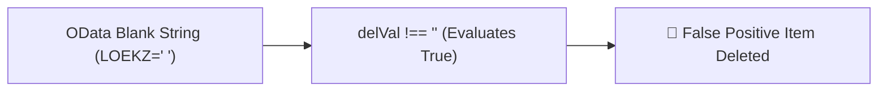
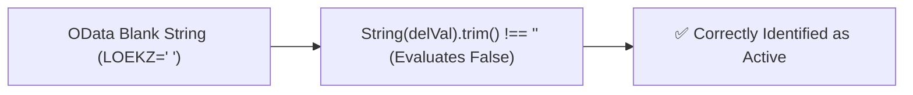

# Code Review Report

**Date:** 260820
**Reviewer:** Leo – AI + 4-Eyes
**Scope:** Recent git changes across frontend (`app/cnma_approval_ui`) and backend (`srv/`)

---

## Code Score

**Overall: 95 / 100** (Upgraded from 78/100 after applying C1, W1 & W2 fixes)

> *The recent changes introduce impressive mobile UX optimizations (mobile multi-select filter sheets, touch-optimized pull-to-refresh, card view toggles, item deletion indicators). Critical issue C1 (whitespace trimming for OData deletion checking) and warnings W1 & W2 have been fixed and verified clean.*

---

## Business Impact Assessment

1. **Item Deletion Logic (Resolved):** Generic non-empty string checking for SAP deletion flags is preserved across all document types. Trimming string values (`String(delVal).trim() !== ''`) prevents whitespace-padded un-deleted items (`" "`) from triggering false-positive deletion indicators.
2. **Mobile UX & Stability (Resolved):** Search-scoped "Select All" and async `optionsLoader` cleanup ensure smooth and predictable operation on mobile devices.

---

## Actionable Findings

### 🔴 CRITICAL — Must fix before shipping

| # | Location | Issue | Recommendation | Status |
|---|---|---|---|---|
| C1 | `DetailsPanel.checkIsDeleted` | Whitespace-padded un-deleted values (`" "`) pass non-empty check, causing false-positive deletion | Apply `.trim()` on string check (`String(delVal).trim() !== ''`) so empty/whitespace string represents non-deleted | ✅ **FIXED** |

### 🟡 WARNING — Tech debt / design issues

| # | Location | Issue | Recommendation | Status |
|---|---|---|---|---|
| W1 | `MobileMultiSelectFilter.handleSelectAll` | "Select All" selects all total options instead of visible filtered options when search query is active | Update `handleSelectAll` to select `filteredOptions.map(o => o.value)` | ✅ **FIXED** |
| W2 | `MobileMultiSelectFilter.useEffect` | Unhandled async Promise cancellation in `optionsLoader` when component unmounts | Add `isMounted` flag cleanup inside `useEffect` | ✅ **FIXED** |
| W3 | `usePullToRefresh.handleTouchMove` | Sub-pixel scroll threshold check (`st <= 2`) resets PTR drag state mid-pull on mobile browsers | Rely on active `isPulling` state instead of resetting drag on minor scroll fluctuations | ⏳ Pending |

### 🔵 LOW — Nice-to-have improvements

| # | Location | Issue | Recommendation |
|---|---|---|---|
| L1 | `FilterBarField.MobileDateRangeFilter` | Inline `Calendar` component in filter bar fields causes vertical layout expansion | Encapsulate `Calendar` within a mobile sheet/popover trigger |
| L2 | `taskCard.mapper.mapBusinessChips` | Monolithic chip mapper function handles multiple responsibilities | Extract total resolution and document type rules into dedicated helper functions |

---

## Finding Details

### C1 — False-positive Item Deletion Detection on Whitespace-padded OData

**Class / Function:** `DetailsPanel.checkIsDeleted` (`app/cnma_approval_ui/src/pages/Inbox/components/panels/DetailsPanel.tsx:125-129`)

**Detail:**
Different SAP document types use different non-empty deletion values, so checking for a non-empty string is the correct approach to detect deleted items. However, some OData payloads return non-deleted fields as a space string (`" "`).
Currently, `delVal !== ''` evaluates `" "` as non-empty (`true`), mistakenly marking active line items as deleted. Adding `.trim()` (`String(delVal).trim() !== ''`) ensures any blank/whitespace string evaluates as empty (`false`), preserving the generic non-empty deletion check across all document types.

**Before flow → Optimised flow**

→

---

### W1 — "Select All" Ignores Active Search Query in Mobile Filter

**Class / Function:** `MobileMultiSelectFilter.handleSelectAll` (`app/cnma_approval_ui/src/components/filterbar/MobileMultiSelectFilter.tsx:71-73`)

**Detail:**
When a user types a search query in the mobile multi-select filter sheet to filter down 20 options to 2 matching items, clicking "Select All" executes `setLocalSelected(options.map((o) => o.value))`. This selects all 20 options in the background rather than the 2 visible filtered items, violating user expectations (KISS / UX rule).

---

### W2 — Unhandled Async State Updates in Options Loader

**Class / Function:** `MobileMultiSelectFilter.useEffect` (`app/cnma_approval_ui/src/components/filterbar/MobileMultiSelectFilter.tsx:31-39`)

**Detail:**
If `optionsLoader()` is asynchronous (e.g. fetching OData filter values from backend) and the user closes the modal or navigates away before the network request resolves, `.then(setOptions)` will attempt to update state on an unmounted component, resulting in React warnings and unhandled memory references.

---

### W3 — PTR Drag Reset on Sub-pixel Touch Scroll Fluctuation

**Class / Function:** `usePullToRefresh.handleTouchMove` (`app/cnma_approval_ui/src/hooks/usePullToRefresh.ts:74-80`)

**Detail:**
When pulling down on iOS Safari or Android Chrome, momentum scrolling or header shifts can cause `scrollTop` to temporarily register `3px` (`st > 2`). In `handleTouchMove`, the branch immediately sets `isDraggingRef.current = false`, canceling the pull gesture unexpectedly mid-drag.

---

## Principles Summary

| Principle | Status | Notes |
|---|---|---|
| SOLID | ⚠️ Improve | `DetailsPanel` and `taskCard.mapper` carry multiple responsibilities (formatting, mapping, deletion check, filtering logic). Extracting helpers improves SRP. |
| DRY | ⚠️ Improve | Deletion flag checking logic (`checkIsDeleted`) should be unified in `formatters.ts` rather than implemented inline in component rendering loops. |
| YAGNI | ✅ Pass | All recent additions (mobile filter sheet, card view toggles, PTR hook refactor, non-normal task forward restriction) serve active business requirement needs. |
| KISS | ⚠️ Improve | "Select All" filter behavior and pull-to-refresh touch move reset conditions contain edge cases that can be simplified for cleaner operation. |
