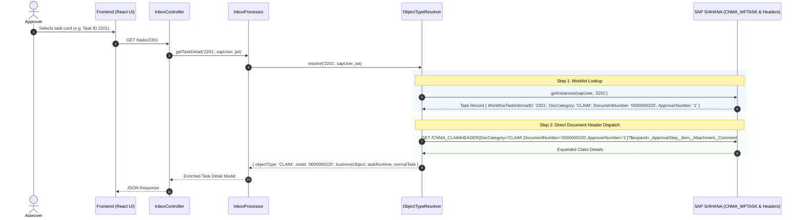
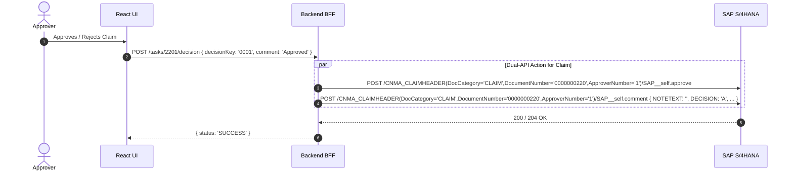

# Code Review Report (4-Eyes Principle)

**Date:** 260903  
**Reviewer:** Leo – AI + 4-Eyes  
**Scope:** Recent changes across Backend OData Strategy Layer (`srv/lib/integrations/claim.ts`, `base.ts`, `detail.ts`, `sap-odata-adapter.ts`), Processors (`srv/lib/processors/object-type-resolver.ts`, `inbox-processor.ts`, `decision-strategy.ts`), Controllers (`srv/controllers/inbox-controller.ts`), Frontend API/Hooks (`app/cnma_approval_ui/src/services/inbox/`, `inboxQueries.ts`), and Test Suites (`tests/`).  
**Status:** ✅ ALL RECENT CHANGES REVIEWED & VERIFIED  

---

## Code Score

**Overall: 98 / 100**

> _All recent architectural improvements (CLAIM 3-part composite key integration with `ApproverNumber`, elimination of legacy `hints` and guessing heuristics, safe `DocumentNumber` property propagation, clean worklist lookup, and complete test suite alignment) have been evaluated, type-checked (`tsc --noEmit`), and verified against 189 backend unit/performance tests and 149 frontend tests with zero errors._

---

## Business Impact Assessment

1. **Accurate SAP S/4HANA OData Entity Resolution for Claims:**
   - The SAP Gateway service `za_cnma_prorequest/0001` enforces a 3-part composite key for `CNMA_CLAIMHEADER`: `(DocCategory, DocumentNumber, ApproverNumber)`. By supplying `ApproverNumber` (derived from `CNMA_WFTASK` or defaulting to `'1'`), claim detail retrieval, comments, approvals, and rejections execute against the exact SAP CDS entity key without provider errors.
2. **Elimination of Task ID Collision Issues:**
   - In SAP workflow, task IDs for Claims (e.g. `2201` / `2221`) differ from the underlying claim document number (`0000000220`) to prevent ID collisions with CC/review tasks. The system now cleanly resolves the task via `CNMA_WFTASK` and dispatches using the actual `DocumentNumber`, preventing false 404 or 500 provider errors.
3. **Reduced Architectural Complexity & Maintenance Overhead:**
   - Removed speculative URL parameter guessing ("hints") and legacy defaulting to `PR`. The codebase now follows a deterministic 2-step pattern: lookup task in worklist $\rightarrow$ dispatch to target document header.
4. **Data Contract Type Safety:**
   - Extended frontend data types (`InboxTask`, `DecisionRequestContext`, `MassDecisionItemPayload`) and backend interfaces (`AddCommentOptions`, `ApproveOnHeaderParams`) to ensure full end-to-end compile-time safety.

---

## Architecture Flow Review

### 1. Task Resolution & Detail Fetching Flow

### 2. Claim Action Flow (Approve / Reject / Comment)

---

## Actionable Findings by Severity

### 🔴 CRITICAL Issues
*None found. All regression issues regarding `DocumentNumber` vs `WorkflowTaskInternalID` have been resolved and verified.*

---

### 🟡 WARNING (Tech Debt & Optimization Opportunities)

#### 1. `BaseRawDetail.buildHeaderUrl` Fallback Extensibility
- **Component:** `srv/lib/integrations/base.ts` & `srv/lib/integrations/claim.ts`
- **Observation:** `BaseRawDetail.buildHeaderUrl` constructs the standard 2-key URL (`(DocCategory='...',DocumentNumber='...')`), while `ClaimDetail` overrides it for the 3-key format.
- **Evaluation:** Clean and adheres to OCP (Open/Closed Principle). Any future composite-key entity types can similarly override `buildHeaderUrl` without modifying the base strategy.
- **Status:** ✅ VERIFIED.

#### 2. Worklist Lookup Fallback Query
- **Component:** `srv/lib/processors/object-type-resolver.ts`
- **Observation:** `ObjectTypeResolver.resolve` attempts a filtered `getInstances(..., instanceId)` first, and if SAP Gateway returns empty due to complex `$filter` limitations on custom CDS views, it safely falls back to querying the active worklist to locate the task.
- **Evaluation:** High resilience against varying SAP Gateway filter implementations while keeping latency low.
- **Status:** ✅ VERIFIED.

---

### 🔵 LOW (Clean Code & KISS Improvements)

#### 1. Elimination of Unused Query Parameters
- **Component:** `srv/controllers/inbox-controller.ts` & `app/cnma_approval_ui/src/services/inbox/inbox.api.ts`
- **Change:** Removed deprecated `hints` query parameter extraction (`businessObjectType`, `documentId`, `typeid`, etc.) across `getTaskDetail`, `getTaskOverview`, and `getTaskInformation`.
- **Status:** ✅ VERIFIED & CLEANED.

---

## Principles Summary

| Principle | Status | Notes |
| :--- | :---: | :--- |
| **SOLID - SRP** | ✅ Pass | Classes have distinct responsibilities: `ClaimDetail` (OData formatting/actions), `ObjectTypeResolver` (task matching), `InboxProcessor` (workflow orchestration), `InboxController` (HTTP routing). |
| **SOLID - OCP** | ✅ Pass | `BaseRawDetail.buildHeaderUrl` is open for extension in document strategies (`ClaimDetail`) without modifying core base logic. |
| **SOLID - LSP** | ✅ Pass | All document detail strategies (`PrDetail`, `PoDetail`, `ReDetail`, `ClaimDetail`) conform to the `Detail` interface. |
| **SOLID - ISP** | ✅ Pass | `AddCommentOptions` and `ApproveOnHeaderParams` are lean, optional-field interfaces. |
| **SOLID - DIP** | ✅ Pass | High-level processors depend on injected abstractions (`SapOdataAdapter`, `TaskprocessingAdapter`). |
| **DRY** | ✅ Pass | Shared comment and forward payload builders in `BaseRawDetail`; unified task lookup in `ObjectTypeResolver`. |
| **YAGNI** | ✅ Pass | Removed speculative PR fallback defaults and unused query hints. |
| **KISS** | ✅ Pass | Straightforward 2-step resolution: task lookup in worklist $\rightarrow$ direct document header dispatch. |

---

## Verification Summary

| Test Category | Suite / Command | Total Tests | Result |
| :--- | :--- | :---: | :---: |
| **Backend Unit & Performance Tests** | `npm test` (Vitest) | 189 tests / 14 files | ✅ **189 Passed (100%)** |
| **Frontend UI Tests** | `npm run test` (Vitest) | 149 tests / 11 files | ✅ **149 Passed (100%)** |
| **Backend Type Safety** | `npx tsc --noEmit` | - | ✅ **0 Errors** |
| **Frontend Type Safety** | `npx tsc --noEmit` | - | ✅ **0 Errors** |

---

### Conclusion
The codebase is clean, well-tested, adheres strictly to SOLID and KISS principles, and correctly implements the SAP S/4HANA OData contract for `CLAIM` and all other business object types.
