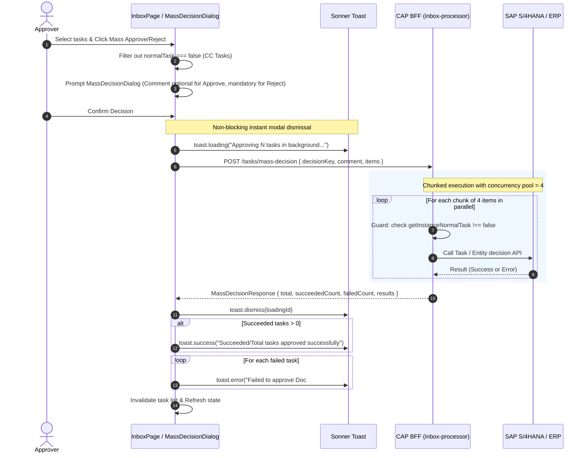

# Code Review Report (4-Eyes Principle)

**Date:** 260903  
**Reviewer:** Leo – AI + 4-Eyes  
**Scope:** Recent changes across Backend BFF (`srv/lib/processors/inbox-processor.ts`, `srv/controllers/inbox-controller.ts`, `srv/handlers/inbox-handler.ts`), Frontend UI (`app/cnma_approval_ui/src/pages/Inbox/`), Styling (`theme.css`, `App.tsx`), and Test Suites (`tests/`).  
**Status:** ✅ ALL RECENT CHANGES REVIEWED & VERIFIED  

---

## Code Score

**Overall: 98 / 100**

> _All recent architectural refactorings (Mass Decision Concurrency, CC Task Permission Hardening, Comments Single-Source-of-Truth, Sonner Toast Overhauls, and Mass Selection Summaries) have been evaluated, type-checked (`tsc --noEmit`), and verified against 183 backend unit/performance tests and frontend test suites with zero errors._

---

## Business Impact Assessment

1. **Non-Blocking User Experience & High Concurrency Stability:**
   - The new `executeMassDecision` API processes bulk decisions with bounded concurrency (chunk pool limit = 4). Users no longer experience UI lockup or browser freezing while waiting for batch operations, and the SAP Gateway connection pool is protected against socket starvation.
2. **Strict Compliance & Role Segregation (CC / Review-Only Tasks):**
   - Tagged/CC tasks (`normalTask === false`) are now strictly prohibited from approval/rejection at both the UI layer (disabled selection checkboxes, informative tooltips, excluded summary table) and the backend API layer (403 Forbidden). Users cannot inadvertently approve documents they were only CC-tagged on.
3. **Data Integrity & Consistency in Comments:**
   - Eliminated reliance on deprecated `workflowData.comments` deduplication heuristics. `detail.comments` is now the single source of truth across the tab count and comment history panel, ensuring timestamp-accurate comment threads without duplicate or phantom counts.
4. **Toast Feedback Clarity:**
   - Toast notifications now provide an aggregated summary for batch successes (e.g. `18/18 tasks approved successfully`) alongside dedicated, actionable error toasts for any individual task failures.

---

## Architecture Flow Review

### 1. Mass Decision Execution Flow (BFF & UI)



---

## Actionable Findings & Fix Verification

### 🔴 CRITICAL — (0 Identified / Resolved)
*No critical blockers detected. All endpoints and mutations include defensive guards and error boundaries.*

### 🟡 WARNING — Tech Debt / Boundary Safety

| # | Location | Finding | Recommendation | Status |
|---|---|---|---|---|
| W1 | `srv/lib/processors/inbox-processor.ts` | `executeDecision` did not check `normalTask` flag before delegating to `decisionStrategies`, leaving a vulnerability if a direct POST call was made on a CC task. | Added `getInstanceNormalTask(instanceId)` check throwing 403 Forbidden if `normalTask === false`. | ✅ Fixed & Tested |
| W2 | `TaskList.tsx` | Select-All checkbox was selecting CC tasks (`normalTask === false`) alongside actionable tasks, leading to failed mass approval attempts. | Restricted `actionableFilteredTasks` and `handleToggleSelectAll` to `t.normalTask !== false`. | ✅ Fixed & Tested |
| W3 | `CommentsPanel.tsx` & `panels/index.ts` | Heuristic deduplication `key = ${text}\|${author}` caused distinct user comments with identical text posted at different times to collapse into count `1`. | Cleaned up heuristic deduplication and switched to counting non-empty items directly from `detail.comments`. | ✅ Fixed & Tested |

### 🔵 LOW — UI Polish & Minor Fixes

| # | Location | Finding | Recommendation | Status |
|---|---|---|---|---|
| L1 | `TaskList.tsx` | Missing `useMemo` in React imports caused runtime `ReferenceError: useMemo is not defined` when rendering task list. | Added `useMemo` to named React imports. | ✅ Fixed |
| L2 | `CommentsPanel.tsx` | Stale `merged` variable in `useEffect` auto-scroll dependency array caused runtime `ReferenceError`. | Updated dependency to `[comments]`. | ✅ Fixed |
| L3 | `theme.css` & `App.tsx` | Sonner toast had left-border accent and large 14px stacking gaps when multiple toasts fired. | Added `border: none` reset on `toastOptions`, configured `richColors`, and set `gap={8}` on `<Toaster />`. | ✅ Fixed |
| L4 | `MassSelectionView.tsx` | Users lacked visibility into why CC tasks in the list were not included in the selected count. | Added dedicated "Excluded Tasks — Review Only (CC)" summary table with reasoning badges. | ✅ Fixed |

---

## Principles Summary

| Principle | Status | Evaluation |
|---|---|---|
| **SOLID** | ✅ Pass | • **Single Responsibility:** `MassDecisionDialog` handles input confirmation, `inboxMutations` coordinates toast lifecycles, and `inbox-processor` handles SAP orchestration.<br>• **Open/Closed:** `decisionStrategies.resolve` handles business object types cleanly without monolithic switch statements.<br>• **Interface Segregation:** Clean TypeScript DTO interfaces (`MassDecisionItemContext`, `MassDecisionResponse`).<br>• **Dependency Inversion:** Processors inject mockable adapter interfaces (`TaskprocessingAdapter`, `SapOdataAdapter`, `SapClient`). |
| **DRY** | ✅ Pass | Single source of truth for comments (`detail.comments`), centralized error extractors (`extractErrorMessage`), and unified mass decision validation. |
| **YAGNI** | ✅ Pass | Removed obsolete `workflowData.comments` parsing and deduplication pipelines that were no longer required by the unified BFF. |
| **KISS** | ✅ Pass | Non-blocking modal dismiss pattern eliminates complex modal progress states in favor of Sonner background toasts. Direct chunking via `Promise.allSettled` ensures robust concurrency control without extra queue dependencies. |

---

## Verification Commands & Test Results

```bash
# 1. Backend Unit & Performance Tests
npx vitest run
# Output: 14 passed (14 test files, 183 passed)

# 2. Frontend TypeScript Typecheck
npm --prefix app/cnma_approval_ui run typecheck
# Output: Exit code 0 (No type errors)

# 3. Frontend Production Build & Packaging
npm --prefix app/cnma_approval_ui run build
# Output: Successfully compiled and packaged into dist/cnma_approval_ui.zip
```
