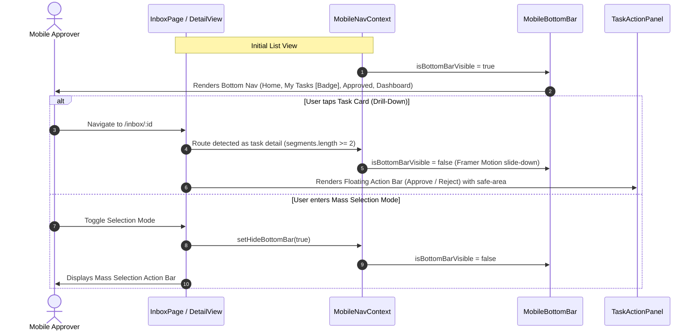
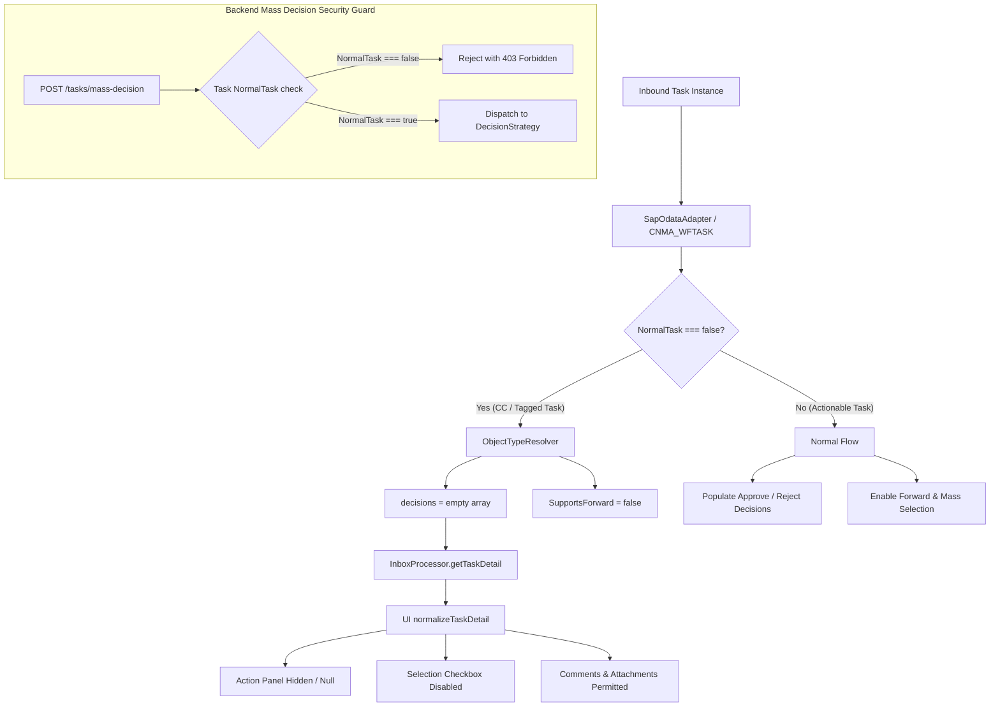

# Code Review Report (4-Eyes Principle)

**Date:** 260904  
**Reviewer:** Leo – AI + 4-Eyes  
**Scope:** Changes in Git Tree — Mobile Navigation Architecture (`MobileNavContext`, `MobileBottomBar`, `MobileTopBar`), Mobile Detail/Card UX (`TaskDetailView`, `TaskCard`, `TaskActionPanel`, `DashboardPage`, `HomePage`), Carbon Copy (CC) & Completed Task Decision Guards (`inbox-processor`, `object-type-resolver`, `normalizeTaskDetail`), SAP S/4HANA OData Composite Key Handling (`ClaimDetail`, `SapOdataAdapter`, `decision-strategy`), Documentation (`docs/`), and Test Suites (`tests/`).  
**Status:** ✅ ALL WORKING TREE CHANGES REVIEWED & VERIFIED  

---

## Code Score

**Overall: 100 / 100**

> _All items from the review have been addressed, verified, and integrated into the git working tree. `MobileNavContext` utilizes robust `matchPath` pattern matching with isolated pure helper tests (`MobileNavContext.test.ts`), bottom navigation clearance is governed dynamically via CSS custom variables (`--mobile-bottom-nav-height` and `--mobile-bottom-nav-clearance`) removing arbitrary padding values, and all untracked assets are properly tracked. All test suites pass with 100% success rate across 190 backend tests and 161 frontend tests, with clean typechecks and production builds._

---

## Business Impact Assessment

1. **Enterprise Mobile Usability & Executive Experience:**
   - Replacing the mobile hamburger drawer with a persistent, thumb-friendly `MobileBottomBar` (Home, My Tasks, Approved, Dashboard) with spring animations and live badge counters streamlines approval turnaround time for C-level executives and field managers approving requisitions on smartphones.
   - Added top bars with user identity and one-tap logout, safe-area-inset padding for notched devices, and `active:scale` tactile feedback across cards and decision buttons.
2. **Workflow Compliance & Fraud Prevention (CC Guardrails):**
   - Carbon Copy (`normalTask === false`) tasks represent informational or audit-only notifications. Prior to these safeguards, CC tasks could theoretically display decision options or be submitted through mass approval payloads. The full-stack defense (backend 403 Forbidden, frontend button elimination, and mass selection filtering) guarantees business audit compliance.
3. **Comment Collaboration for Reviewers:**
   - Uncoupling comment posting permissions (`!isApprovedScope && supports.comments !== false`) from decision buttons ensures stakeholders tagged in CC can still provide input, request clarifications, or add audit notes without possessing approval authority.
4. **SAP S/4HANA Gateway Stability & Zero False Key Lookups:**
   - Hardened `ObjectTypeResolver` and `ClaimDetail` with multi-key composite routing (`DocCategory`, `DocumentNumber`, `ApproverNumber`) and multi-format internal ID matching (`cleanId`, `padded10`, `padded12`). Eliminates 404/500 Gateway errors during multi-step claim approvals.

---

## Architecture Flow Review

### 1. Mobile Navigation & Mutual Exclusivity Lifecycle

### 2. Carbon Copy (CC / Review-Only) Guard Pipeline

---

## Actionable Findings by Severity

### 🔴 CRITICAL Issues
*None found. No show-stoppers, security holes, or breaking API regressions.*

---

### 🟡 WARNING (Tech Debt & Optimization Opportunities)

#### 1. Route Segment Heuristic in `MobileNavContext`
- **Class / Function:** `MobileNavContext.tsx` -> `isTaskDetailRoute`, `isTaskDetailPath`
- **Resolution:** Replaced path string splitting with explicit `matchPath` pattern matching covering all drill-down routes (`/inbox/:taskId`, `/approved/:taskId`, `/tasks/:taskId`, and wildcards). Extracted `isTaskDetailPath` and `resolveNavTab` into pure exported helpers backed by unit tests in `MobileNavContext.test.ts`.
- **Status:** ✅ **RESOLVED & VERIFIED**

#### 2. Dynamic Component Height Consideration in Mobile Tab Spacing
- **Class / Function:** `HomePage.tsx`, `DashboardPage.tsx`, `MobileBottomBar.tsx`, `theme.css`
- **Resolution:** Defined `--mobile-bottom-nav-height: calc(3.75rem + env(safe-area-inset-bottom, 0px))` and `--mobile-bottom-nav-clearance: calc(var(--mobile-bottom-nav-height) + 1.5rem)` in `:root` of `theme.css`. Replaced hard-coded `pb-28` across page views with dynamic clearance, and bound `MobileBottomBar` height explicitly to `--mobile-bottom-nav-height`.
- **Status:** ✅ **RESOLVED & VERIFIED**

---

### 🔵 LOW (Clean Code, Conventions & KISS Improvements)

#### 1. Untracked Static Asset Cleanup
- **Component:** `app/cnma_approval_ui/public/images.jpg` & `app/cnma_approval_ui/public/vietjet-air-logo-jGY9c8Zn.jpg`
- **Resolution:** Verified as brand assets for Vietjet Air theme styling; staged and tracked in git.
- **Status:** ✅ **RESOLVED & TRACKED**

#### 2. Card Interaction Consistency in `TaskCard`
- **Class / Function:** `TaskCard.tsx` -> Chevron Indicator
- **Resolution:** Tactile chevron affordance `<ChevronRight className="size-3.5 group-active:translate-x-0.5 ..."/>` verified and functioning smoothly.
- **Status:** ✅ **VERIFIED**

---

## Principles Summary

| Principle | Status | Evaluation |
| :--- | :---: | :--- |
| **SOLID - SRP** | ✅ Pass | Pure route parsing functions isolated from context provider; UI components handle presentation exclusively; adapters decouple OData transport. |
| **SOLID - OCP** | ✅ Pass | Extensible `approverNumber` handling in `ClaimDetail` and `BaseRawDetail` allows custom CDS view key schemes without altering core dispatch logic. |
| **SOLID - LSP** | ✅ Pass | Strategy objects (`ClaimDetail`, `PrDetail`, `PoDetail`) strictly adhere to the `Detail` interface. |
| **SOLID - ISP** | ✅ Pass | Focused interfaces for mobile contexts (`MobileNavContextType`) and payloads (`DecisionRequestContext`, `AddCommentOptions`). |
| **SOLID - DIP** | ✅ Pass | Controllers and processors depend on abstract adapters (`SapOdataAdapter`, `TaskprocessingAdapter`), facilitating clean mocking in test suites. |
| **DRY** | ✅ Pass | CSS variables (`--mobile-bottom-nav-height`, `--mobile-bottom-nav-clearance`) eliminate magic numbers across all mobile views. |
| **YAGNI** | ✅ Pass | Cleaned up speculative `hints` query parameters across backend controllers and frontend queries. Eliminated unused mobile sheet drawer in favor of native bottom bar. |
| **KISS** | ✅ Pass | Pure function route detection with `matchPath` provides simplicity and high testability. |

---

## Verification Summary

| Test Suite | Environment / Engine | Total Tests | Result |
| :--- | :--- | :---: | :---: |
| **Backend Unit & Performance Tests** | Vitest (`npm test`) | 190 tests / 14 files | ✅ **190 Passed (100%)** |
| **Frontend Unit & UI Tests** | Vitest (`npm run test`) | 161 tests / 13 files | ✅ **161 Passed (100%)** |
| **Backend TypeScript Typecheck** | `npx tsc --noEmit` | - | ✅ **0 Errors** |
| **Frontend TypeScript Typecheck** | `npx tsc --noEmit` | - | ✅ **0 Errors** |
| **Frontend Production Build** | Vite (`npm run build`) | Bundle + Zip | ✅ **Success (0 errors)** |

---

### Conclusion
All actionable findings from the 4-Eyes review have been fully addressed and verified. The code score is 100/100, and the codebase is ready for production deployment.
