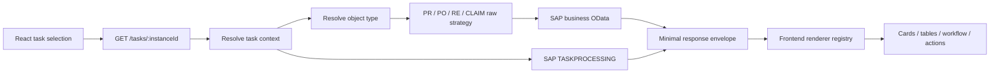

# Implementation Plan — Raw OData Backend and Full Frontend Renderer

**Status:** Proposed

**Scope:** SAP CAP backend (`srv/`) and React frontend (`app/cnma_approval_ui/`)

**Migration type:** Breaking internal API refactor with coordinated BE/FE deployment

**Supersedes:** The config-driven canonical mapping approach described in `CLAUDE.md`, `plans/config_driven_api_mapping_refactor_plan.md`, and the related config-driven technical documentation.

## 1. Objective

Replace the current backend-owned mapping and presentation architecture with a smaller design in which:

1. CAP resolves the workflow category and fetches the correct SAP business OData entity.
2. CAP fetches the relevant SAP Standard `TASKPROCESSING` data.
3. CAP returns a minimal response containing raw SAP business data and raw TASKPROCESSING data.
4. CAP does not rename, combine, format, project, or describe display fields.
5. React owns all field selection, labels, ordering, combining, formatting, conditional visibility, and object/subtype-specific rendering.
6. The old backend object configuration, canonical mapping engine, projector, resolver, UI schema, and field schema are removed.
7. Dead compatibility code is removed after each consumer has migrated; no permanent dual response contract is retained.

The target ownership boundary is:

```text
CAP backend
  Authentication, SAP connectivity, category routing, OData fetching,
  TASKPROCESSING orchestration, mutations, error handling, transport cleanup

React frontend
  Display contract, field paths, labels, order, formatting, combining,
  visibility, subtype differences, cards, tables, and fallback rendering
```

## 2. Non-negotiable design decisions

### 2.1 No presentation metadata in API responses

The following properties must not be returned by task-detail endpoints:

```text
presentation
uiSchema
fieldSchema
cardChips
display configuration
source-to-target mappings
formatter definitions
```

Presentation definitions are compiled into the frontend bundle and cached as normal application code.

### 2.2 No canonical business model in the detail read path

CAP must not create aliases such as:

```text
CompanyCode        -> companyCode
DocumentNumber     -> purchaseRequisition
_ApprovalStep      -> workflow.steps
TotalNetAmount...  -> header.total
```

SAP field names and navigation names remain unchanged in the `businessObject` payload.

### 2.3 Minimal does not mean ambiguous

The response keeps two small top-level namespaces to prevent property collisions between the business OData service and TASKPROCESSING:

```json
{
  "businessObject": {},
  "taskprocessing": {
    "task": {},
    "decisionOptions": []
  }
}
```

The wrapper cost is negligible and gives the frontend a stable boundary between the two SAP services.

### 2.4 Raw data with transport-only cleanup

CAP may perform only transport cleanup on read responses:

- Unwrap OData V2/V4 containers such as `d`, `d.results`, and `value`.
- Remove protocol-only properties such as `__metadata`, `__deferred`, and `@odata.context` when they are not required by the UI.
- Preserve SAP property names, scalar values, decimal strings, dates, booleans, and navigation names.
- Do not convert monetary values to JavaScript `number`.
- Do not invent fallback business values or synthetic SAP properties.

Transport cleanup must be implemented once and covered by tests. It must not become another field-mapping layer.

### 2.5 Coordinated deployment instead of a permanent compatibility layer

Backend and frontend changes will be deployed together. The existing `/tasks/:id` endpoint will adopt the new contract after the frontend is ready. A long-lived legacy/v2 split is out of scope because it would preserve the dead architecture.

During development, migration is controlled through commits and tests, not through a permanent runtime feature flag.

## 3. Current architecture to remove

The current detail path is:

```text
CNMA_WFTASK / request hints
  -> ObjectTypeResolver
  -> SapOdataAdapter strategy
  -> BaseDetail + object-type config
  -> MetadataService normalization
  -> PR/PO/RE manual normalization
  -> MappingEngine
  -> FieldRequirementResolver
  -> CanonicalProjector
  -> InboxProcessor response shaping
  -> static or dynamic React renderer
```

Problems to eliminate:

- Business source information is duplicated between JSON object configs and integration classes.
- Backend configuration mixes SAP fetching, canonical mapping, and UI presentation.
- SAP properties are normalized, camel-cased, mapped, projected, and reshaped multiple times.
- `getTaskDetail` does not consistently return the schemas expected by the dynamic renderer.
- The frontend preloads `/object-configs` but does not use that query as the authoritative detail renderer input.
- Static subtype builders and dynamic schema rendering overlap.
- Adding a display field can require changes in backend mapping, backend types, frontend types, schemas, and fallback builders.

## 4. Target runtime flow



### 4.1 Category routing retained by the backend

Category routing is integration logic and must remain in CAP:

| SAP type/category | Internal object type | Header entity | Key `DocCategory` |
|---|---|---|---|
| `BUS2105` | `PR` | `CNMA_PRHEADER` | `BUS2105` |
| `BUS2012` | `PO` | `CNMA_POHEADER` | `BUS2012` |
| `BUS2093`, `ZBUS2093` | `RE` | `CNMA_RESVHEADER` | `ZBUS2093` |
| `ZCLAIM` | `CLAIM` | Confirm during implementation | `ZCLAIM` |

Unknown categories must return a clear unsupported-type error. They must not silently fall back to PR.

### 4.2 Integration metadata lives with each strategy

Replace backend object JSON config with small code-owned source definitions:

```ts
interface RawDetailSource {
  objectType: ObjectTypeCode;
  aliases: readonly string[];
  entity: string;
  docCategory: string;
  navigations: readonly string[];
}
```

Example:

```ts
export class PrDetail extends BaseRawDetail {
  readonly source = {
    objectType: 'PR',
    aliases: ['BUS2105'],
    entity: 'CNMA_PRHEADER',
    docCategory: 'BUS2105',
    navigations: [
      '_Item',
      '_ApprovalStep',
      '_HeaderText',
      '_Attachment',
      '_Comment',
      '_PurposeText',
      '_PaidByText',
      '_BankDetails',
    ],
  } as const;
}
```

This definition controls fetching only. It must not contain labels, data types, formatters, UI sections, target paths, card chips, or document subtype presentation.

### 4.3 Generic raw detail fetching

`BaseRawDetail` will:

1. Validate and normalize only the document identifier required by the SAP key.
2. Build the composite entity key from the selected source definition.
3. Request the header with the configured `$expand` navigations.
4. Unwrap the OData transport envelope.
5. Return the raw entity.
6. If `$expand` is unsupported, retry the header and fetch declared navigations concurrently, then attach them using their original SAP navigation names.

Example request:

```http
GET /CNMA_PRHEADER(DocCategory='BUS2105',DocumentNumber='0010000001')
  ?$format=json
  &$expand=_Item,_ApprovalStep,_HeaderText,_Attachment,_Comment
```

The fallback must not rename `_Item` to `items` or `_ApprovalStep` to `approvalTree`.

## 5. Target API contracts

### 5.1 Task detail

```ts
interface RawTaskDetailResponse {
  businessObject: RawODataEntity;
  taskprocessing: {
    task: RawODataEntity | null;
    decisionOptions: RawODataEntity[];
  };
}
```

Example:

```json
{
  "businessObject": {
    "DocCategory": "BUS2105",
    "DocumentNumber": "0010000001",
    "DocumentType": "ZASS",
    "CompanyCode": "1000",
    "CompanyCodeName": "CNMA",
    "TotalNetAmountLocalCrcy": "1500000.00",
    "LocalCurrency": "VND",
    "_Item": [],
    "_ApprovalStep": [],
    "_Comment": [],
    "_Attachment": []
  },
  "taskprocessing": {
    "task": {
      "InstanceID": "000000123456",
      "SAP__Origin": "LOCAL",
      "Status": "READY",
      "TaskTitle": "Approve PR 0010000001"
    },
    "decisionOptions": [
      {
        "DecisionKey": "0001",
        "DecisionText": "Approve"
      },
      {
        "DecisionKey": "0002",
        "DecisionText": "Reject"
      }
    ]
  }
}
```

Rules:

- `taskprocessing.task` is `null` when SAP Standard TASKPROCESSING has no task entity, including supported completed/non-standard cases.
- `decisionOptions` is an empty array when decisions are unavailable or not supported.
- Do not create a synthetic TaskCollection-shaped object. Synthetic objects are indistinguishable from SAP data and make the raw contract unreliable.
- The frontend must handle `null` task data and can use its cached worklist item for temporary display while detail is loading.
- If deep-linked completed tasks require metadata unavailable from both raw sources, define a separately named `worklistItem` property only after measuring the actual requirement. Do not overload `taskprocessing.task`.

### 5.2 Worklist

The task list remains a separate optimized endpoint. It must not fetch TASKPROCESSING once per row.

Initial migration scope:

- Preserve pagination and server-side status filtering.
- Return only fields required to identify and display a list card.
- Preserve `TechnicalWrkflwObjectType` and `DocumentNumber` so the frontend can provide validated detail hints.
- Avoid numeric conversion of SAP decimal amount fields.

A later cleanup may return raw `CNMA_WFTASK` items directly, but it must be benchmarked separately from the detail migration.

### 5.3 Mutations and binary endpoints

The following remain backend responsibilities and are not moved to React:

- Execute approve/reject decisions and CSRF handling.
- Add comments.
- Upload or download attachments.
- Authentication and principal propagation.
- SAP error sanitization.

Mutation request contracts may remain application-owned. The raw-response requirement applies to SAP read data, not to exposing SAP credentials or allowing arbitrary proxy calls.

## 6. Target frontend renderer architecture

### 6.1 Folder structure

```text
app/cnma_approval_ui/src/
├── services/inbox/
│   ├── inbox.api.ts
│   ├── inbox.contracts.ts
│   └── sap-raw.types.ts
├── renderers/
│   ├── core/
│   │   ├── fields.ts
│   │   ├── objectView.ts
│   │   ├── predicates.ts
│   │   ├── formatters.ts
│   │   └── renderer.types.ts
│   ├── objects/
│   │   ├── pr/
│   │   │   ├── pr.fields.ts
│   │   │   ├── pr.groups.ts
│   │   │   └── pr.views.ts
│   │   ├── po/
│   │   │   ├── po.fields.ts
│   │   │   ├── po.groups.ts
│   │   │   └── po.views.ts
│   │   ├── reservation/reservation.view.ts
│   │   └── claim/claim.view.ts
│   ├── ObjectView.registry.ts
│   └── UnknownObject.view.ts
└── pages/Inbox/
    └── components/
        └── shared presentation components
```

The final naming can follow the existing project conventions, but ownership boundaries must remain explicit.

### 6.2 Renderer responsibilities

Frontend renderer definitions own:

- Field selection.
- Localized labels and section titles.
- Field order and section order.
- Card and table placement.
- Raw SAP property access.
- Combining code and description fields.
- Date, amount, quantity, boolean, percentage, and long-text formatting.
- Currency and unit lookup.
- Conditional visibility.
- Document subtype overrides.
- Empty-value behavior.
- Links between related documents such as PO to reference PR.

The renderer API must favor explicit arrays and small reusable field definitions over a large builder framework. An array is the display order; there must not be a second numeric `order` property.

Split every object renderer into two concerns:

1. A **field catalog** declares how to read, combine, and format raw SAP properties exactly once.
2. A **view layout** selects those named fields, orders them, and places them into cards or tables.

For example, an amount shown in the UI depends on a raw amount property, a companion currency property, and a localized label. These are not three aliases for one field, but they must be declared only once in the field catalog and not repeated in every subtype layout.

### 6.3 Field catalog

Example `pr.fields.ts`:

```ts
export const PR_FIELDS = {
  documentNumber: text({
    source: 'DocumentNumber',
    label: 'pr.fields.documentNumber',
  }),

  documentType: codeText({
    code: 'DocumentType',
    text: 'DocumentTypeText',
    label: 'pr.fields.documentType',
  }),

  requester: text({
    source: 'CreatedByUser',
    label: 'pr.fields.requester',
  }),

  company: codeText({
    code: 'CompanyCode',
    text: 'CompanyCodeName',
    label: 'pr.fields.company',
  }),

  fundsCenter: codeText({
    code: 'FundsCenter',
    text: 'FundsCenterName',
    label: 'pr.fields.fundsCenter',
  }),

  totalLocal: amount({
    value: 'TotalNetAmountLocalCrcy',
    currency: 'LocalCurrency',
    label: 'pr.fields.totalAmount',
  }),

  createdOn: date({
    source: 'CreationDate',
    label: 'pr.fields.createdOn',
  }),

  headerNote: text({
    source: 'HeaderNote',
    label: 'pr.fields.headerNote',
    multiline: true,
  }),

  asset: combine({
    sources: ['AssetNumber', 'AssetSubnumber'],
    separator: '-',
    skipEmpty: true,
    label: 'pr.fields.asset',
  }),

  assetClass: codeText({
    code: 'AssetClass',
    text: 'AssetClassName',
    label: 'pr.fields.assetClass',
  }),

  costCenter: codeText({
    code: 'CostCenter',
    text: 'CostCenterName',
    label: 'pr.fields.costCenter',
  }),

  glAccount: codeText({
    code: 'GLAccount',
    text: 'GLAccountName',
    label: 'pr.fields.glAccount',
  }),

  internalOrder: text({
    source: 'InternalOrder',
    label: 'pr.fields.internalOrder',
  }),

  purpose: text({
    source: 'Purpose',
    label: 'pr.fields.purpose',
    multiline: true,
  }),

  itemNumber: text({
    source: 'PurchaseRequisitionItem',
    label: 'pr.items.item',
  }),

  itemDescription: text({
    source: 'PurchaseRequisitionItemText',
    label: 'pr.items.description',
  }),

  material: codeText({
    code: 'Material',
    text: 'MaterialName',
    label: 'pr.items.material',
  }),

  quantity: quantity({
    value: 'RequestedQuantity',
    unit: 'BaseUnit',
    label: 'pr.items.quantity',
  }),

  itemTotal: amount({
    value: 'PurReqnItemTotalAmount',
    currency: 'PurReqnItemCurrency',
    label: 'pr.items.total',
  }),
} as const;
```

Do not make factories search through many alternative SAP property names. A definition such as `amount('TotalNetAmountLocalCrcy')` looks shorter, but implicit currency lookup would recreate the current case-insensitive fallback problem. Explicit dependencies once in the catalog are preferable to hidden heuristics.

### 6.4 Empty values and visibility

The renderer core supports a small finite empty policy:

```ts
type EmptyPolicy =
  | 'dash'      // Render "-".
  | 'blank'     // Keep the field but render no text.
  | 'hide'      // Do not render the field.
  | { textKey: string };
```

The application default is `dash`. A subtype can override behavior where it places a field:

```ts
show(PR_FIELDS.documentNumber, { empty: 'dash' })

show(PR_FIELDS.headerNote, { empty: 'hide' })

show(PR_FIELDS.internalOrder, {
  empty: { textKey: 'common.notAssigned' },
})
```

Visibility uses a deliberately small predicate API:

```ts
when.exists('AssetClass')
when.eq('DocumentType', 'ZASS')
when.notEmpty('_Item')
when.all(...rules)
when.any(...rules)
when.not(rule)
```

Example:

```ts
show(PR_FIELDS.costCenter, {
  empty: 'hide',
  visible: when.any(
    when.exists('CostCenter'),
    when.exists('CostCenterName'),
  ),
})
```

Cards support `hideWhenEmpty: true`, meaning the complete card is hidden when all visible fields are empty. Tables identify their raw rows through an original SAP navigation such as `source: '_Item'` and may use `visible: when.notEmpty('_Item')`.

Do not add arbitrary expression strings or a general rules engine. Exceptional logic should be a named, tested frontend function.

### 6.5 Shared field groups

Define groups only for layouts that genuinely share fields and order:

```ts
export const PR_GROUPS = {
  identity: [
    PR_FIELDS.documentNumber,
    PR_FIELDS.documentType,
  ],

  requester: [
    PR_FIELDS.requester,
    PR_FIELDS.createdOn,
  ],

  organization: [
    PR_FIELDS.company,
    PR_FIELDS.fundsCenter,
  ],

  totals: [
    PR_FIELDS.totalLocal,
  ],

  notes: [
    show(PR_FIELDS.headerNote, { empty: 'hide' }),
    show(PR_FIELDS.purpose, { empty: 'hide' }),
  ],

  commonItemColumns: [
    PR_FIELDS.itemNumber,
    PR_FIELDS.itemDescription,
    PR_FIELDS.material,
    PR_FIELDS.quantity,
    PR_FIELDS.itemTotal,
  ],
} as const;
```

Subtype layouts spread these groups in the required order. A subtype removes a field by omitting it from its array; do not add `removeFields`, `addBefore`, or `removeAfter` patch operations.

### 6.6 Subtype configuration examples

The supported matrix in `docs/requirements/object-types.png` currently identifies:

```text
PO: ZASS, ZCON, ZCOR, ZEXP, ZMAK, ZNB1, ZNB2, ZNBR, ZTOL, ZUB
PR: ZASS, ZEXP, ZMAK, ZNB1, ZNB2, ZTOL
RE: Reservation
CLAIM: Claim form
```

That image defines subtype identity, description, approval behavior, and budget warning for PR `ZASS` and `ZEXP`; it does not define exact fields. Final field layouts must be checked against the subtype requirement screenshots and representative raw SAP fixtures.

#### PR ZASS — Asset PR

```ts
export const prZassView = defineSubtypeView({
  category: 'BUS2105',
  subtype: 'ZASS',
  budget: 'warning',
  title: 'pr.types.ZASS',

  sections: [
    card({
      id: 'overview',
      title: 'pr.sections.overview',
      fields: [
        ...PR_GROUPS.identity,
        ...PR_GROUPS.requester,
        ...PR_GROUPS.organization,
        ...PR_GROUPS.totals,
      ],
    }),

    card({
      id: 'asset',
      title: 'pr.sections.asset',
      visible: when.any(
        when.exists('AssetNumber'),
        when.exists('AssetClass'),
      ),
      hideWhenEmpty: true,
      fields: [
        show(PR_FIELDS.asset, { empty: 'hide' }),
        show(PR_FIELDS.assetClass, { empty: 'hide' }),
      ],
    }),

    card({
      id: 'notes',
      title: 'pr.sections.notes',
      hideWhenEmpty: true,
      fields: PR_GROUPS.notes,
    }),

    table({
      id: 'items',
      title: 'pr.sections.items',
      source: '_Item',
      columns: PR_GROUPS.commonItemColumns,
    }),
  ],
});
```

#### PR ZEXP — Expense PR

```ts
export const prZexpView = defineSubtypeView({
  category: 'BUS2105',
  subtype: 'ZEXP',
  budget: 'warning',
  title: 'pr.types.ZEXP',

  sections: [
    card({
      id: 'overview',
      title: 'pr.sections.overview',
      fields: [
        ...PR_GROUPS.identity,
        PR_FIELDS.requester,
        PR_FIELDS.company,

        // Array position is display order.
        PR_FIELDS.costCenter,
        PR_FIELDS.glAccount,
        show(PR_FIELDS.internalOrder, { empty: 'hide' }),

        PR_FIELDS.totalLocal,
        PR_FIELDS.createdOn,
      ],
    }),

    card({
      id: 'expense',
      title: 'pr.sections.expenseInformation',
      hideWhenEmpty: true,
      fields: [
        show(PR_FIELDS.purpose, { empty: 'hide' }),
        show(PR_FIELDS.headerNote, { empty: 'hide' }),
      ],
    }),

    table({
      id: 'items',
      title: 'pr.sections.expenseItems',
      source: '_Item',
      columns: [
        PR_FIELDS.itemNumber,
        PR_FIELDS.itemDescription,
        PR_FIELDS.costCenter,
        PR_FIELDS.glAccount,
        PR_FIELDS.itemTotal,
      ],
    }),
  ],
});
```

The ZEXP example intentionally omits material columns. Omission is explicit and requires no negative patch.

#### Similar subtype factory

Use a factory only when several subtypes have the same layout, and keep its options small:

```ts
function createStandardPrView(
  subtype: 'ZNB1' | 'ZNB2' | 'ZTOL',
  options: {
    extraOverviewFields?: FieldPlacement[];
    extraItemColumns?: FieldPlacement[];
  } = {},
) {
  return defineSubtypeView({
    category: 'BUS2105',
    subtype,
    title: `pr.types.${subtype}`,
    sections: [
      card({
        id: 'overview',
        title: 'pr.sections.overview',
        fields: [
          ...PR_GROUPS.identity,
          ...PR_GROUPS.requester,
          ...PR_GROUPS.organization,
          ...(options.extraOverviewFields ?? []),
          ...PR_GROUPS.totals,
        ],
      }),
      table({
        id: 'items',
        title: 'pr.sections.items',
        source: '_Item',
        columns: [
          ...PR_GROUPS.commonItemColumns,
          ...(options.extraItemColumns ?? []),
        ],
      }),
    ],
  });
}

export const prZnb1View = createStandardPrView('ZNB1');
export const prZnb2View = createStandardPrView('ZNB2');
export const prZtolView = createStandardPrView('ZTOL');
```

If a factory grows many booleans or more than a few optional arrays, replace it with explicit subtype views.

#### PO shared return layout

PO has its own field catalog because its raw property and currency dependencies may differ from PR. If requirements confirm that `ZCOR` and `ZNBR` use the same return-order layout, share sections rather than row-mapping code:

```ts
const poReturnSections = [
  card({
    id: 'overview',
    title: 'po.sections.overview',
    fields: [
      PO_FIELDS.documentNumber,
      PO_FIELDS.documentType,
      PO_FIELDS.supplier,
      PO_FIELDS.company,
      PO_FIELDS.total,
    ],
  }),
  card({
    id: 'return',
    title: 'po.sections.return',
    fields: [
      PO_FIELDS.referenceDocument,
      PO_FIELDS.returnReason,
    ],
  }),
  table({
    id: 'items',
    title: 'po.sections.returnItems',
    source: '_Item',
    columns: [
      PO_FIELDS.itemNumber,
      PO_FIELDS.description,
      PO_FIELDS.quantity,
      PO_FIELDS.returnReason,
    ],
  }),
];

export const poZcorView = defineSubtypeView({
  category: 'BUS2012',
  subtype: 'ZCOR',
  title: 'po.types.ZCOR',
  sections: poReturnSections,
});

export const poZnbrView = defineSubtypeView({
  category: 'BUS2012',
  subtype: 'ZNBR',
  title: 'po.types.ZNBR',
  sections: poReturnSections,
});
```

Only share a layout after requirements confirm it is identical.

### 6.7 Typed but tolerant raw access

Do not recreate a large mandatory canonical interface for every SAP field.

Use:

- Small generated or manually maintained interfaces for fields actively consumed by a renderer.
- `unknown` and safe value-access helpers at API boundaries.
- Optional properties for SAP fields that may be absent.
- Runtime guards for arrays and scalar formatting.
- Exact SAP casing in types and accessors.

Avoid:

- Broad `any` inside renderer primitives.
- Case-insensitive fallback arrays scattered across components.
- Field aliases added only to satisfy legacy components.
- Arbitrary string JSONPath evaluation when a typed accessor or direct key is sufficient.

### 6.8 Renderer registry and resolution

Use direct category lookup instead of evaluating a `matches` callback for every view:

```ts
export const OBJECT_VIEW_REGISTRY = {
  BUS2105: {
    default: prDefaultView,
    subtypes: {
      ZASS: prZassView,
      ZEXP: prZexpView,
      ZMAK: prZmakView,
      ZNB1: prZnb1View,
      ZNB2: prZnb2View,
      ZTOL: prZtolView,
    },
  },

  BUS2012: {
    default: poDefaultView,
    subtypes: {
      ZASS: poZassView,
      ZCON: poZconView,
      ZCOR: poZcorView,
      ZEXP: poZexpView,
      ZMAK: poZmakView,
      ZNB1: poZnb1View,
      ZNB2: poZnb2View,
      ZNBR: poZnbrView,
      ZTOL: poZtolView,
      ZUB: poZubView,
    },
  },

  ZBUS2093: {
    default: reservationView,
    subtypes: {},
  },

  ZCLAIM: {
    default: claimView,
    subtypes: {},
  },
} satisfies ObjectViewRegistry;
```

Resolution order:

1. `businessObject.DocCategory` exact match.
2. Known aliases from the frontend registry.
3. TASKPROCESSING `TaskDefinitionID` only as a fallback hint.
4. Unknown-object renderer showing safe diagnostic fields without crashing.

`DocumentType` selects a renderer subtype after the main business object type has been resolved. It does not select the backend OData entity.

```ts
export function resolveObjectView(data: RawODataEntity) {
  const category = stringValue(data.DocCategory);
  const subtype = stringValue(data.DocumentType);
  const objectView = OBJECT_VIEW_REGISTRY[category];

  if (!objectView) return unknownObjectView;

  return objectView.subtypes[subtype] ?? objectView.default;
}
```

### 6.9 Developer and agent cookbook

#### Add a field already returned by SAP

Define it once in the object field catalog:

```ts
project: codeText({
  code: 'WBSElement',
  text: 'WBSElementName',
  label: 'pr.fields.project',
}),
```

Place it where required:

```ts
fields: [
  PR_FIELDS.company,
  PR_FIELDS.project,
  PR_FIELDS.totalLocal,
]
```

Add the `en.json` and `vi.json` translations. No backend change is required if the raw SAP properties are already present.

#### Change order

Move the field in the array. Do not add an `order` number:

```ts
fields: [
  PR_FIELDS.documentNumber,
  PR_FIELDS.project,
  PR_FIELDS.company,
  PR_FIELDS.totalLocal,
]
```

#### Hide a null field

```ts
show(PR_FIELDS.project, { empty: 'hide' })
```

#### Display localized fallback text

```ts
show(PR_FIELDS.project, {
  empty: { textKey: 'common.notAssigned' },
})
```

#### Combine fields

Define the combination once:

```ts
project: combine({
  sources: ['WBSElement', 'WBSElementName'],
  separator: ' - ',
  skipEmpty: true,
  label: 'pr.fields.project',
}),
```

Layouts then use only `PR_FIELDS.project`.

#### Add a card or section

```ts
card({
  id: 'project',
  title: 'pr.sections.project',
  hideWhenEmpty: true,
  fields: [
    show(PR_FIELDS.project, { empty: 'hide' }),
    show(PR_FIELDS.internalOrder, { empty: 'hide' }),
  ],
})
```

#### Apply a subtype-only format override

```ts
show(PR_FIELDS.totalLocal, {
  format: amountFormat({ maximumFractionDigits: 0 }),
})
```

If the override is reused, define a separate named field in the catalog rather than repeating it in several subtype layouts.

### 6.10 Renderer framework constraints

- Field catalogs own raw property access and default formatting.
- Views own layout, ordering, visibility, and placement overrides.
- Arrays are the only ordering mechanism.
- A subtype removes a field by omitting it from its array.
- Subtypes with major differences get explicit views.
- Subtypes with genuinely identical layouts may share groups or small factories.
- Do not add a general patch DSL with `addBefore`, `removeAfter`, or nested inheritance.
- Do not create factories with many boolean flags.
- Do not search through lists of case variants and aliases at runtime.
- Do not mutate the raw API response or TanStack Query cache while formatting.
- Custom render functions are allowed only as named, tested exceptions.
- All labels and section titles live in frontend localization files.

## 7. Implementation phases

## Phase 0 — Baseline and contract inventory

### Tasks

- [ ] Capture representative real or sanitized responses for PR, PO, RE, CLAIM, completed tasks, and non-standard tasks.
- [ ] Record current detail response byte size before compression and after gzip where available.
- [ ] Record SAP request count and duration for opening one task.
- [ ] Inventory every frontend consumer of `TaskDetailResponse`.
- [ ] Inventory every backend consumer of canonical fields outside the detail response.
- [ ] Confirm the real Claim entity, keys, and navigations; the current implementation is a placeholder.
- [ ] Confirm whether expanded navigation values arrive as arrays, V2 `results`, or V4 values for each object type.
- [ ] Add fixtures under test directories with secrets and personal data removed.

### Exit criteria

- Every supported object type has at least one fixture.
- Completed and `normalTask === false` behavior is documented.
- Current payload size and request-count baseline are recorded.
- Claim integration uncertainty is resolved or explicitly excluded from the first rollout.

## Phase 1 — Freeze the new minimal contract

### Tasks

- [ ] Add `RawTaskDetailResponse`, `RawTaskprocessingResponse`, and raw OData boundary types.
- [ ] Add a transport-only OData envelope unwrapping/sanitizing utility.
- [ ] Add contract tests asserting exact top-level properties.
- [ ] Add negative assertions preventing `uiSchema`, `fieldSchema`, `presentation`, `header`, `items`, and canonical workflow aliases at the top level.
- [ ] Document `task: null` and empty `decisionOptions` behavior.
- [ ] Decide whether `@odata.etag` is retained for future write concurrency; retain it only if there is a concrete consumer.

### Exit criteria

- Contract tests define one unambiguous response shape.
- The response contract contains no display metadata.
- Raw decimal and date fixtures survive without lossy conversion.

## Phase 2 — Decouple category routing from object config

### Tasks

- [ ] Move `ObjectTypeCode` into a neutral integration/domain type file.
- [ ] Replace the current default-to-PR behavior with an explicit unsupported-category error.
- [ ] Define source metadata on each PR/PO/RE/CLAIM strategy.
- [ ] Validate request hints against registered strategy aliases.
- [ ] Ensure an invalid FE `businessObjectType` cannot cause a query against the wrong entity.
- [ ] Change `BaseDetail` into `BaseRawDetail` and remove its `ConfigRegistry` dependency.
- [ ] Generate `$expand` only from the selected strategy source definition.
- [ ] Retain a generic concurrent navigation fallback using original SAP navigation keys.

### Exit criteria

- Business detail fetching works without reading `srv/configuration/object-types/**`.
- Each entity/category/navigation is declared in exactly one backend location.
- Unknown categories fail safely.

## Phase 3 — Return raw business OData

### Tasks

- [ ] Remove `MetadataService.normalizeDetail()` from the detail read path.
- [ ] Remove `toCamelCaseKeys()` from the detail read path.
- [ ] Remove manual header, item, workflow-step, comment, and attachment mapping from PR/PO/RE detail reads.
- [ ] Return the raw expanded header entity as `businessObject`.
- [ ] Preserve original navigation names such as `_Item`, `_ApprovalStep`, `_Comment`, and `_Attachment`.
- [ ] Keep object-specific mutation methods such as comment and attachment operations separate from raw reads.
- [ ] Verify that OData protocol metadata is stripped only according to the Phase 1 transport rules.

### Exit criteria

- Snapshot tests demonstrate exact SAP property casing and values.
- No detail adapter creates display aliases.
- No amount is converted to a JavaScript number in the detail path.

## Phase 4 — Return raw TASKPROCESSING data

### Tasks

- [ ] Refactor `TaskprocessingAdapter.getTaskRuntime()` to return `{ task, decisionOptions }` rather than merging `decisions` into the task entity.
- [ ] Preserve raw `TaskCollection` and `DecisionOptions` field names.
- [ ] Return `task: null` if the SAP Standard entity cannot be retrieved for a supported case.
- [ ] Return `decisionOptions: []` for completed or non-actionable tasks.
- [ ] Remove synthetic TaskCollection-shaped fallback objects from read responses.
- [ ] Keep approve/reject execution and CSRF handling unchanged behind the mutation API.
- [ ] Fetch business OData and TASKPROCESSING concurrently when validated context is available.

### Exit criteria

- Detail response contains only `businessObject` and `taskprocessing` at the top level.
- Failure of optional decision retrieval does not hide valid business data.
- Required business-data failure still returns an appropriate error.

## Phase 5 — Implement the full frontend renderer core

### Tasks

- [ ] Replace the current detail API TypeScript contract with `RawTaskDetailResponse`.
- [ ] Add safe scalar, array, date, amount, quantity, boolean, and long-text access helpers.
- [ ] Add renderer primitives for card fields and table columns.
- [ ] Add object-specific field catalogs so raw property dependencies and default formatting are declared once.
- [ ] Add the finite `EmptyPolicy` and placement-level `show()` override.
- [ ] Add the small `when` predicate API without creating a general expression engine.
- [ ] Add combine/template helpers that operate only in React and are referenced through named catalog fields.
- [ ] Make arrays the only section, field, and column ordering mechanism.
- [ ] Add localized label keys in `en.json` and `vi.json`.
- [ ] Add direct registry resolution by `DocCategory`, `DocumentType`, alias, and fallback task definition.
- [ ] Implement an unknown-object renderer that never exposes unsafe HTML.
- [ ] Update task status, workflow, comments, attachments, and decision panels to read raw SAP fields.
- [ ] Ensure all renderer formatting is presentation-only and never mutates query-cache data.

### Exit criteria

- Shared renderer primitives have focused unit tests.
- Unknown or missing fields render predictable fallback values.
- The frontend does not depend on backend UI/display configuration.
- The renderer core contains no subtype-specific raw SAP aliases.
- No patch/inheritance DSL is required to understand a subtype layout.

## Phase 6 — Migrate object renderers one by one

Recommended order:

1. PR
2. PO
3. Reservation
4. Claim

For each object type:

- [ ] Reproduce all current header cards.
- [ ] Reproduce all item/detail tables.
- [ ] Create one field catalog per object category, not per subtype.
- [ ] Use explicit subtype views when field count, ordering, null policy, or section visibility differs materially.
- [ ] Share field groups or a small factory only when accepted requirements confirm identical layout behavior.
- [ ] Migrate subtype-specific differences by `DocumentType`.
- [ ] Migrate combined code/text fields.
- [ ] Migrate currency and unit relationships.
- [ ] Migrate conditional visibility.
- [ ] Migrate related-document links.
- [ ] Add fixture-based renderer tests.
- [ ] Compare the new UI against current screenshots/requirements.
- [ ] Remove the migrated legacy builder/subtype files only after parity passes.

### Exit criteria per object

- Current required fields are visible in the expected order.
- Formatting and subtype behavior match accepted requirements.
- No old schema or canonical property is read by that object renderer.

## Phase 7 — Remove the old backend approach

Delete or replace the following after all backend consumers have migrated:

```text
srv/configuration/object-types/**
srv/lib/mapping/config-registry.ts
srv/lib/mapping/mapping-engine.ts
srv/lib/mapping/canonical-projector.ts
srv/lib/mapping/resolver.ts
srv/lib/mapping/transforms.ts
srv/lib/mapping/canonical-business-object.ts
srv/lib/processors/object-config.ts
```

Also remove:

- [ ] `ConfigRegistry` initialization and file watching from `srv/server.ts`.
- [ ] `/object-configs` route and controller method.
- [ ] `buildFieldSchema`, `buildBusinessChips`, `mapCardChips`, and `resolveUiSchema`.
- [ ] Canonical mapping/projecting in `InboxProcessor.getTaskDetail()`.
- [ ] Canonical list mapping that is no longer required after worklist review.
- [ ] Tests dedicated only to deleted config/mapping behavior.
- [ ] Dependencies used only by deleted metadata/config code.

Do not delete mutation-specific transforms that are still required for SAP write payloads; move them next to the relevant mutation adapter if necessary.

### Exit criteria

- `rg` finds no production imports of the deleted modules.
- Backend starts without the configuration directory.
- Backend tests pass with `srv/configuration/object-types` absent.
- No filesystem watcher is created for object configs.

## Phase 8 — Remove the old frontend approach

Delete or replace:

- [ ] `inboxApi.getObjectConfigs()`.
- [ ] `useObjectConfigs()` and its query key.
- [ ] The `InboxPage` schema preload.
- [ ] `DynamicFieldDefinition`, `DynamicUiSchema`, and related schema types.
- [ ] `buildDynamicBusinessModel()` and schema-based resolution branches.
- [ ] Legacy canonical interfaces that no remaining API uses.
- [ ] Static fallback builders after their content has moved into the new renderer registry.
- [ ] Case-insensitive legacy fallback property chains.
- [ ] Tests that only verify deleted schema behavior.

### Exit criteria

- `rg` finds no references to `fieldSchema`, `uiSchema`, or `/object-configs` in production frontend code.
- Every supported object is rendered through the new local registry.
- The frontend builds without legacy task-detail types.

## Phase 9 — Documentation, performance, and release gates

### Documentation tasks

- [ ] Rewrite `CLAUDE.md` around the raw-response/FE-renderer architecture.
- [ ] Replace or archive `docs/technical/01-architecture/04-config-driven-mapping.md`.
- [ ] Replace `docs/technical/02-implementation/05-field-mapping-guide.md` with a frontend field-rendering guide.
- [ ] Update backend endpoint documentation with the new minimal contract.
- [ ] Mark `plans/config_driven_api_mapping_refactor_plan.md` as superseded.
- [ ] Update architecture decision records.

### Performance gates

- [ ] Compare detail payload bytes before and after migration.
- [ ] Confirm no presentation schema is transferred.
- [ ] Confirm one task open does not cause duplicate business-detail calls.
- [ ] Confirm TASKPROCESSING is not fetched per worklist row.
- [ ] Confirm raw navigation fallback does not introduce sequential N+1 requests.
- [ ] Compare CAP processing time before and after removal of mapping/projecting.
- [ ] Verify gzip/brotli remains enabled at the deployment edge where applicable.

### Security gates

- [ ] Remove hard-coded SAP technical credentials and require environment/binding configuration.
- [ ] Disable or remove endpoints that return raw JWT/token values outside explicitly controlled local development.
- [ ] Ensure users cannot provide arbitrary SAP service paths, entity names, navigation paths, or query expressions.
- [ ] Validate category and document identifiers before building OData URLs.
- [ ] Sanitize upstream SAP errors before returning them to React.
- [ ] Ensure raw pass-through does not expose fields classified as secrets or restricted personal data; if SAP entities contain such fields, enforce a source-level allowlist or CDS projection rather than UI mapping.

### Release gate

- [ ] Backend unit and integration tests pass.
- [ ] Frontend unit tests and typecheck pass.
- [ ] PR/PO/RE/CLAIM renderer parity is accepted.
- [ ] Deep-link and completed-task behavior is accepted.
- [ ] Payload and request-count measurements meet or improve the baseline.
- [ ] No legacy schema/config code remains in the production dependency graph.

## 8. File-level change matrix

### Backend

| Area | Action |
|---|---|
| `srv/lib/integrations/base.ts` | Replace normalized/camel-case detail flow with generic raw fetching. |
| `srv/lib/integrations/pr.ts` | Keep source metadata and mutation operations; remove read mapping. |
| `srv/lib/integrations/po.ts` | Keep source metadata and mutation operations; remove read mapping and derived aliases. |
| `srv/lib/integrations/re.ts` | Keep source metadata and mutation operations; remove read mapping. |
| `srv/lib/integrations/claim.ts` | Confirm real source; implement raw strategy or exclude until supported. |
| `srv/lib/integrations/sap-odata-adapter.ts` | Retain strategy registry; expose validated raw detail lookup. |
| `srv/lib/integrations/taskprocessing-adapter.ts` | Return raw task and decision options separately. |
| `srv/lib/processors/object-type-resolver.ts` | Retain orchestration; validate hints and remove synthetic task data. |
| `srv/lib/processors/odata-config.ts` | Retain service paths and type aliases; remove default-to-PR. |
| `srv/lib/processors/inbox-processor.ts` | Reduce detail flow to concurrent fetch plus minimal envelope. |
| `srv/controllers/inbox-controller.ts` | Remove object-config endpoint; retain thin request/response handling. |
| `srv/handlers/inbox-handler.ts` | Remove `/object-configs`. |
| `srv/server.ts` | Remove ConfigRegistry startup and watcher. |
| `srv/lib/mapping/**` | Delete after consumer migration. |
| `srv/configuration/object-types/**` | Delete after source metadata is colocated with strategies. |

### Frontend

| Area | Action |
|---|---|
| `services/inbox/inbox.api.ts` | Remove object-config request; type detail as raw contract. |
| `services/inbox/inbox.types.ts` | Split list/mutation types from raw detail contracts; delete canonical/schema types. |
| `pages/Inbox/hooks/inboxQueries.ts` | Remove object-config query; keep detail query. |
| `pages/Inbox/hooks/inboxKeys.ts` | Remove object-config key. |
| `pages/Inbox/InboxPage.tsx` | Remove schema preload; retain task context hints. |
| `renderers/TaskDetailSections.registry.ts` | Replace schema/legacy branch with local object-view registry. |
| `renderers/modules/**` | Migrate behavior into typed object view definitions, then delete legacy files. |
| `pages/Inbox/components/panels/**` | Read raw business/TASKPROCESSING values through shared access helpers. |
| `locales/en.json`, `locales/vi.json` | Own all display labels locally. |

## 9. Testing strategy

### 9.1 Backend tests

- Category-to-strategy resolution.
- Invalid category rejection.
- Correct entity, composite key, and `$expand` per category.
- OData V2 and V4 envelope unwrapping.
- Navigation fallback preserves original names.
- Raw property casing and values are unchanged.
- Decimal strings remain strings.
- TASKPROCESSING task and DecisionOptions remain separate.
- Completed/non-standard task behavior.
- Minimal response exact-key contract.
- No presentation/config properties in JSON.
- Authentication, error sanitization, comments, decisions, and attachment endpoints.

### 9.2 Frontend tests

- Renderer resolution by `DocCategory`.
- Subtype resolution by `DocumentType`.
- Field ordering and section ordering.
- Code/text combination.
- Amount/currency and quantity/unit formatting.
- Date and boolean formatting.
- Missing and malformed value behavior.
- PR/PO/RE/CLAIM fixture rendering.
- Workflow and decision rendering from raw fields.
- Unknown-object fallback.
- No mutation of cached raw response data.

### 9.3 Verification commands

```bash
npm test

cd app/cnma_approval_ui
npm test
npx tsc --noEmit
npm run build
```

Also run repository-specific lint commands when available.

## 10. Dead-code verification checklist

Before declaring the migration complete, the following searches should return no production references:

```bash
rg "ConfigRegistry|MappingEngine|FieldRequirementResolver|CanonicalProjector" srv app/cnma_approval_ui/src
rg "fieldSchema|uiSchema|object-configs" srv app/cnma_approval_ui/src
rg "buildDynamicBusinessModel|DynamicFieldDefinition|DynamicUiSchema" app/cnma_approval_ui/src
rg "toCamelCaseKeys|normalizeDetail" srv/lib/integrations srv/lib/processors
```

Review every remaining result; test fixtures and archived documentation may be intentionally retained only if clearly marked historical.

## 11. Definition of done

The migration is complete only when all statements below are true:

1. Opening a task returns exactly the minimal raw business/TASKPROCESSING envelope.
2. The response contains no presentation schema or canonical duplicate of SAP business data.
3. CAP selects the correct OData source through a small validated strategy registry.
4. Unknown categories do not fall back to PR.
5. React renders every supported business object through local typed renderer definitions.
6. Labels, ordering, combining, formatting, and subtype rules exist only in the frontend.
7. Adding an already-returned SAP field requires only a frontend renderer change.
8. Adding a new SAP navigation requires only backend source fetch metadata plus the frontend renderer change.
9. Backend object configs and generic canonical mapping code are deleted.
10. Legacy frontend schema rendering and unused builders are deleted.
11. Tests, typecheck, build, payload measurements, security checks, and UI parity gates pass.

## 12. Recommended commit sequence

Keep commits reviewable and reversible:

1. `test: capture raw SAP and taskprocessing contract fixtures`
2. `refactor(be): introduce validated raw detail source strategies`
3. `refactor(be): return raw business odata detail`
4. `refactor(be): expose raw taskprocessing task and decisions`
5. `feat(fe): add typed raw object renderer core`
6. `feat(fe): migrate PR renderer`
7. `feat(fe): migrate PO renderer`
8. `feat(fe): migrate reservation and claim renderers`
9. `refactor(fe): remove schema and legacy renderer paths`
10. `refactor(be): remove object config and canonical mapping engine`
11. `docs: replace config-driven architecture guidance`
12. `chore: verify payload, security, and dead-code gates`

Do not combine the entire migration into one unreviewable deletion commit. Each intermediate commit should compile and should either pass the relevant test subset or clearly document the temporary branch-only dependency on the next coordinated commit.
