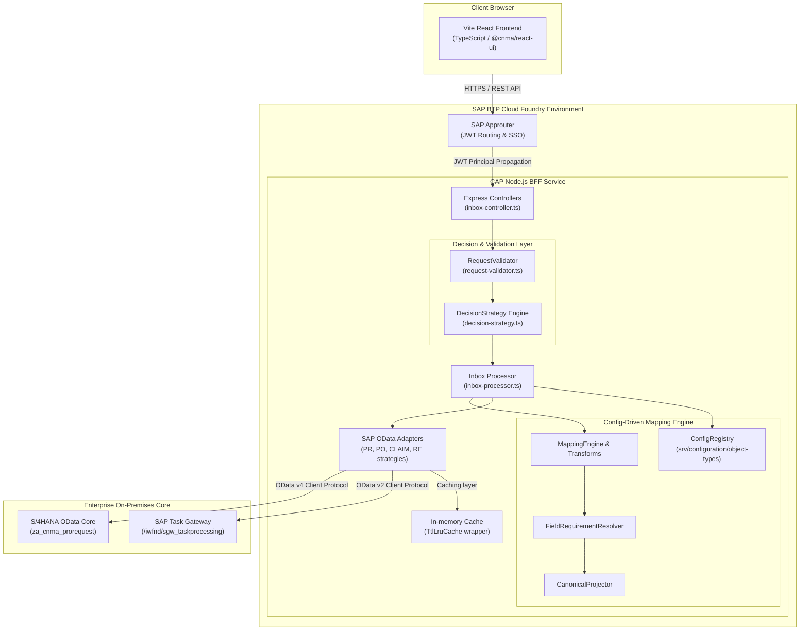
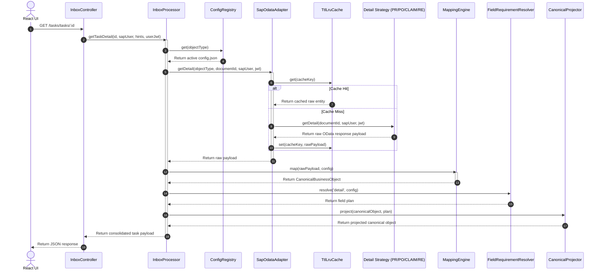

# System Architecture Overview

> **Owner:** Enterprise Solution Architect | **Last Updated:** 2026-08-27 | **Status:** Active

This document provides a high-level technical overview of the **CNMA Approval** system design, integration boundaries, technology stack, and business object transformation architecture.

---

## 🏛️ System Architecture Topology

The application is built as a decoupled Multi-Target Application (MTA) deployed on **SAP Business Technology Platform (BTP)**. It follows the Backend-For-Frontend (BFF) pattern powered by a **Config-Driven Mapping Engine**:

---

## 💻 Technology Stack

### Frontend Client
*   **Framework**: React 18+ powered by Vite (bundler and build system).
*   **Language**: TypeScript.
*   **Styling**: TailwindCSS & custom vanilla CSS for Fiori-inspired aesthetics.
*   **Data Fetching**: React Query (TanStack Query v5) for cache synchronization, stale-while-revalidate, and loading state management.
*   **Dynamic UI**: Schema-driven rendering using `TaskDetailSections.registry.ts` guided by backend `uiSchema`.

### Backend BFF (Backend for Frontend)
*   **Framework**: SAP Cloud Application Programming Model (CAP) Node.js runtime (`@sap/cds`).
*   **Language**: TypeScript.
*   **Web Framework**: Embedded Express.js for routing custom REST APIs (instead of CDS OData).
*   **Mapping Architecture**: Modular, config-driven engine ([`srv/lib/mapping/`](file:///d:/learning/test/cnma_approval/srv/lib/mapping/)) with declarative JSON specifications per object type.
*   **Integration SDK**: SAP Cloud SDK (`@sap-cloud-sdk/http-client`, `@sap-cloud-sdk/connectivity`) to perform destination lookups and authentication propagation.
*   **Authentication**: Passport.js with `@sap/xssec` for JWT token decoding and authorization checks.

### Datastores & Backends
*   **Task Lists**: SAP Task Gateway (supports workflow tasks, approvals, rejections).
*   **Procurement & Financial Records**: SAP S/4HANA ERP core exposing OData services (`APPROVAL_SRV`) supporting multiple document types:
    *   **PR** (Purchase Requisitions - `BUS2105`)
    *   **PO** (Purchase Orders - `BUS2012`)
    *   **CLAIM** (Expense Claims - `BUS2081` / `CLAIM`)
    *   **RE** (Reservations - `BUS2013`)

---

## 🔄 Consolidated Detail Retrieval & Mapping Flow

The system resolves detailed business object data using a Strategy Pattern combined with the **Config-Driven Mapping Engine** ([04-config-driven-mapping.md](file:///d:/learning/test/cnma_approval/docs/technical/01-architecture/04-config-driven-mapping.md)).

For detailed specifications on the mapping engine architecture, configuration schemas, and hot-reloading mechanisms, refer to [Config-Driven Mapping Architecture](file:///d:/learning/test/cnma_approval/docs/technical/01-architecture/04-config-driven-mapping.md).
