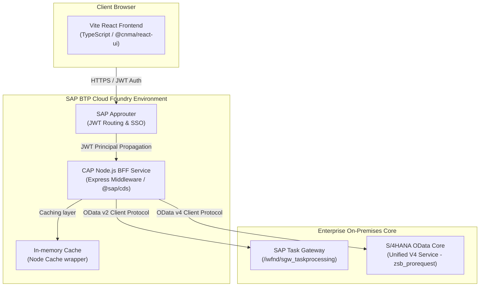
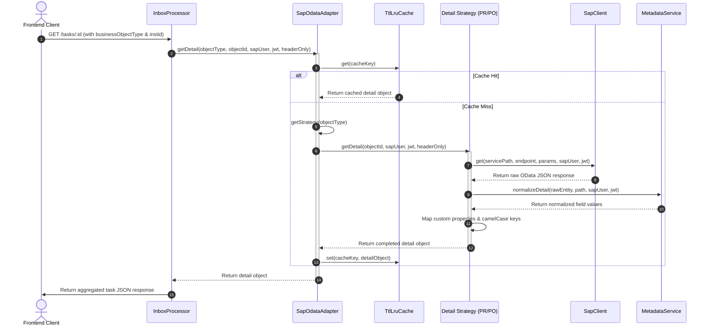

# System Architecture Overview

> **Owner:** Enterprise Solution Architect | **Last Updated:** 2026-07-17 | **Status:** Active

This document provides a high-level technical overview of the **CNMA Approval** system design, integration boundaries, and technology stack.

---

## 🏛️ System Architecture Topology

The application is built as a decoupled Multi-Target Application (MTA) deployed on **SAP Business Technology Platform (BTP)**. It follows the Backend-For-Frontend (BFF) pattern:

---

## 💻 Technology Stack

### Frontend Client
*   **Framework**: React 18+ powered by Vite (bundler and build system).
*   **Language**: TypeScript.
*   **Styling**: TailwindCSS & custom vanilla CSS for Fiori-inspired aesthetics.
*   **Data Fetching**: React Query (TanStack Query v5) for cache synchronization, stale-while-revalidate, and loading state management.
*   **State Management**: React Context APIs for theme settings, user profiles, and active lists.

### Backend BFF (Backend for Frontend)
*   **Framework**: SAP Cloud Application Programming Model (CAP) Node.js runtime (`@sap/cds`).
*   **Language**: TypeScript.
*   **Web Framework**: Embedded Express.js for routing custom REST APIs (instead of CDS OData).
*   **Integration SDK**: SAP Cloud SDK (`@sap-cloud-sdk/http-client`, `@sap-cloud-sdk/connectivity`) to perform destination lookups and authentication propagation.
*   **Authentication**: Passport.js with `@sap/xssec` for JWT token decoding and authorization checks.

### Datastores & Backends
*   **Task Lists**: SAP Task Gateway (supports workflow tasks, approvals, rejections).
*   **Procurement Records**: SAP S/4HANA ERP core exposing a unified OData v4 API (`/sap/opu/odata4/sap/zsb_prorequest/srvd_a2x/sap/zsd_prorequest/0001`) for PR and PO details, comments, and approval logs.

---

## 🔄 Detail Retrieval Flow (Strategy Pattern)

The system resolves detailed business object data using a Strategy Pattern. The [SapOdataAdapter](file:///d:/learning/test/cnma_approval/srv/lib/integrations/sap-odata-adapter.ts) acts as a facade, delegating requests to registered object strategies (such as [PrDetail](file:///d:/learning/test/cnma_approval/srv/lib/integrations/pr.ts) or [PoDetail](file:///d:/learning/test/cnma_approval/srv/lib/integrations/po.ts) implementing the [Detail](file:///d:/learning/test/cnma_approval/srv/lib/integrations/detail.ts) interface).

The sequence diagram below displays the end-to-end data retrieval flow:

