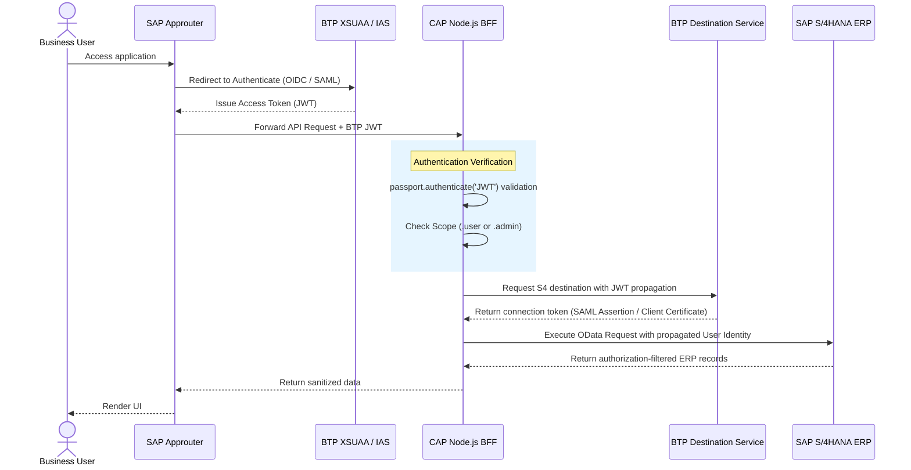

# Authentication & Security Architecture

This document describes the security protocols, token exchange flows, and credential propagation mechanisms used in the **CNMA Approval** application.

---

## 🔒 Security Architecture Model

The portal secures endpoints through token verification and role scopes:

---

## 🔑 Key Security Elements

### 1. SAP Approuter
Deploys as the single entry point. It manages:
*   User session cookie establishment.
*   Cross-Origin Resource Sharing (CORS) prevention.
*   Single Sign-On (SSO) login flow redirects.
*   Forwarding the `x-user-token` or standard `Authorization` headers containing the JWT token to the CAP BFF.

### 2. XSUAA & IAS
*   **IAS (Identity Authentication Service)**: Acts as the primary Identity Provider (IdP) for corporate users.
*   **XSUAA (XML Schema User Account and Authentication)**: Serves as the OAuth2 authorization server on BTP Cloud Foundry, binding security scopes (defined in `xs-security.json`) to JWT tokens.

### 3. JWT Verification in BFF
In [server.ts](file:///d:/learning/test/cnma_approval/srv/server.ts), passport middleware uses the `@sap/xssec` library:
*   The token signature is validated against the BTP tenant verification keys.
*   The system verifies the audience (`aud`) matches the bound XSUAA service broker instance.
*   Scopes are extracted from the payload array (e.g., `uaa.user` / `uaa.admin`).

### 4. Principal Propagation to S/4HANA
To ensure that users can only see documents they are authorized to view in the ERP core:
*   The CAP BFF does not use a master "technical user" in production.
*   It retrieves S/4HANA connectivity details from BTP Destination Service.
*   By setting `Authentication: PrincipalPropagation` on the BTP Destination, the Cloud Connector exchanges the BTP JWT token for a short-lived X.509 certificate or SAML assertion representing the user's ERP identity.
*   The request arrives in S/4HANA under the specific user's credentials, respecting standard SAP ABAP Role-Based Access Control (RBAC).

---

## 🛠️ Local Development Authentication Mocks

To support development and testing offline:
*   **Mock Credentials**: In local profiles, `@sap/cds` runs in `mocked` auth mode (see `package.json` configurations).
*   **Impersonation Header**: Developers can pass the `x-sap-user` header or use `pp-token.mjs` script generation to impersonate any test username (`MOCK_USER`, `admin`, etc.).
*   **Token Debugging**: The Express router mounts routes (`/debug/current-user`, `/debug/jwt`, `/debug/auth-summary`) that return decoded headers, token sources, and claims to help troubleshoot local proxy linkages.
