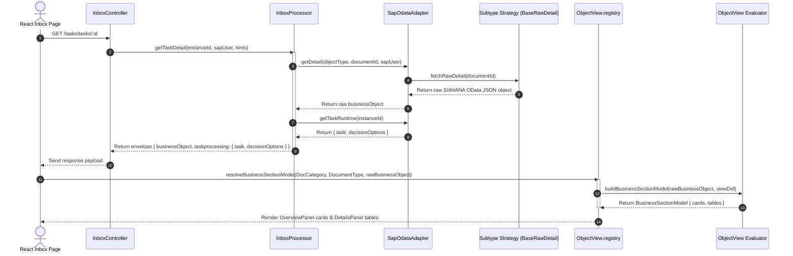

# Raw OData Integration & Declarative Frontend Renderer Architecture

> **Owner:** Lead CAP Architect & Lead Frontend Engineer | **Last Updated:** 2026-08-10 | **Status:** Active

This document describes the design, purposes, data flows, and configuration models of the **Raw OData Backend Integration & Declarative Frontend Renderer Architecture** implemented in the CNMA Approval application.

---

## 1. Purposes & Design Philosophy

The refactoring eliminates complex intermediate mapping layers and hardcoded field translations, addressing three core architectural goals:

1. **Zero Raw Field Alteration:** SAP S/4HANA OData properties (e.g., `DocumentNumber`, `TotalOrderValue`, `CreationDate`) pass through the backend BFF directly without camelCasing, numeric string conversions, or keys renaming. This ensures zero data loss and exact backend parity.
2. **Declarative Rule-Based Frontend Rendering:** Frontend layout definitions map raw OData fields to visual cards, grid columns, tables, and formatters using declarative field catalogs (`[type].fields.ts`) and view specifications (`[type].views.ts`).
3. **Consolidated Single Network Fetch:** The UI loads task detail data in a single REST request (`GET /tasks/tasks/:id`), returning the minimal envelope `{ businessObject, taskprocessing: { task, decisionOptions } }`.

---

## 2. Core Architectural Components

The application architecture cleanly separates raw backend data fetching from frontend declarative rendering:

```
+-----------------------------------------------------------------------+
|                            CAP Backend BFF                            |
|                                                                       |
|  [S/4HANA OData] ---> BaseRawDetail Strategy ---> Minimal JSON Payload |
|                            (srv/lib/integrations/base.ts)             |
+-----------------------------------│-----------------------------------+
                                    │ GET /tasks/tasks/:id
                                    v
+-----------------------------------------------------------------------+
|                          Vite React Frontend                          |
|                                                                       |
| [Raw Business Object] ──> ObjectView.registry.ts ──> ObjectView       |
|                                                      Evaluator        |
|                                                          │            |
|                                                          v            |
|                                                 BusinessSectionModel  |
|                                                 (Cards & Item Tables) |
+-----------------------------------------------------------------------+
```

### 2.1 Backend Raw Integration Engine (`srv/lib/integrations/`)
* **`base.ts` (`BaseRawDetail`)**: Handles generic raw OData querying, `$expand` navigation requests, concurrent sub-entity fallback calls, and metadata envelope removal (`__metadata`, `__deferred`, `@odata.context`) without key transformations.
* **Subtype Strategies (`pr.ts`, `po.ts`, `re.ts`, `claim.ts`)**: Extend `BaseRawDetail` with entity names, doc categories, and navigation sets.

### 2.2 Frontend Declarative Renderer (`app/cnma_approval_ui/src/renderers/`)
* **Core Primitive Types (`core/renderer.types.ts`)**: Defines TypeScript interfaces for `FieldDefinition`, `CardDefinition`, `TableColumnDefinition`, `TableDefinition`, `ObjectViewDefinition`, and `BusinessSectionModel`.
* **Field Factories (`core/fields.ts`)**: Constructors for primitive field definitions (`text`, `codeText`, `amount`, `quantity`, `date`, `tableCol`).
* **Formatters (`core/formatters.ts`)**: Presentation formatters for raw dates, currency amounts, units, and code/description text.
* **Visibility Predicates (`core/predicates.ts`)**: Rule-based visibility helpers (`when.exists`, `when.eq`, `when.in`, `when.notEmpty`, `when.all`, `when.not`).
* **ObjectView Evaluator (`core/objectView.ts`)**: Evaluates raw OData entities against view definitions to produce `BusinessSectionModel` containing resolved cards and tables.
* **Object Catalogs (`objects/`)**:
  - `objects/pr/`: `pr.fields.ts` catalog + `pr.views.ts` subtype definitions (`ZASS`, `ZEXP`, `ZMAK`, `ZNB1`, `ZNB2`, `ZTOL`).
  - `objects/po/`: `po.fields.ts` catalog + `po.views.ts` subtype definitions (`ZASS`, `ZCON`, `ZCOR`, `ZEXP`, `ZMAK`, `ZNB1`, `ZNB2`, `ZNBR`, `ZTOL`, `ZUB`).
  - `objects/reservation/`: `reservation.view.ts` catalog with 10-column ordering.
  - `objects/claim/`: `claim.view.ts` catalog.
* **Master View Registry (`ObjectView.registry.ts`)**: Matches raw `DocCategory` and `DocumentType` to resolve `ObjectViewDefinition` and build `BusinessSectionModel`.

---

## 3. End-to-End Consolidated Data Flow

The sequence diagram below shows how a task detail request flows through the raw OData strategy to the declarative UI renderer:



---

## 4. Declarative Renderer View Specification Example

Object type layouts are defined declaratively in `[type].views.ts`:

```typescript
// Example from po.views.ts
export const standardPoOverviewCard: CardDefinition = {
    id: 'po-overview-card',
    title: 'Overview',
    fields: [
        PO_OVERVIEW_FIELDS.poNumber,
        PO_OVERVIEW_FIELDS.documentType,
        PO_OVERVIEW_FIELDS.requester,
        PO_OVERVIEW_FIELDS.vendor,
        PO_OVERVIEW_FIELDS.releaseStrategy,
        PO_OVERVIEW_FIELDS.companyCode,
        PO_OVERVIEW_FIELDS.creationDate,
        PO_OVERVIEW_FIELDS.paymentTerms,
        PO_OVERVIEW_FIELDS.total
    ]
};

export const standardPoTable: TableDefinition = {
    id: 'po-line-items-table',
    title: 'Line Items',
    itemSource: '_Item',
    columns: [
        PO_TABLE_COLUMNS.item,
        PO_TABLE_COLUMNS.plant,
        PO_TABLE_COLUMNS.storageLocation,
        PO_TABLE_COLUMNS.materialNumber,
        PO_TABLE_COLUMNS.shortText,
        PO_TABLE_COLUMNS.materialGroup,
        PO_TABLE_COLUMNS.quantity,
        PO_TABLE_COLUMNS.uom,
        PO_TABLE_COLUMNS.deliveryDate,
        PO_TABLE_COLUMNS.valuationPrice,
        PO_TABLE_COLUMNS.totalValue,
        PO_TABLE_COLUMNS.referencePr,
        PO_TABLE_COLUMNS.glAccount,
        PO_TABLE_COLUMNS.fundsCenter,
        PO_TABLE_COLUMNS.commitmentItem
    ]
};
```

---

## 5. Developer Guide: Adding a New Object Type

1. **Implement Raw Backend Strategy:** Create `srv/lib/integrations/[newType].ts` extending `BaseRawDetail` and register it in `sap-odata-adapter.ts`.
2. **Define Field Catalog:** Create `app/cnma_approval_ui/src/renderers/objects/[newType]/[newType].fields.ts` using `text()`, `codeText()`, `amount()`, `date()`, `tableCol()`.
3. **Define View Layout:** Create `app/cnma_approval_ui/src/renderers/objects/[newType]/[newType].views.ts` defining card definitions and table column arrays.
4. **Register View Resolver:** Map `DocCategory` and `DocumentType` in `app/cnma_approval_ui/src/renderers/ObjectView.registry.ts`.
5. **Update Task Card Chips:** Map summary info chips in `app/cnma_approval_ui/src/pages/Inbox/mappers/taskCard.mapper.ts`.
