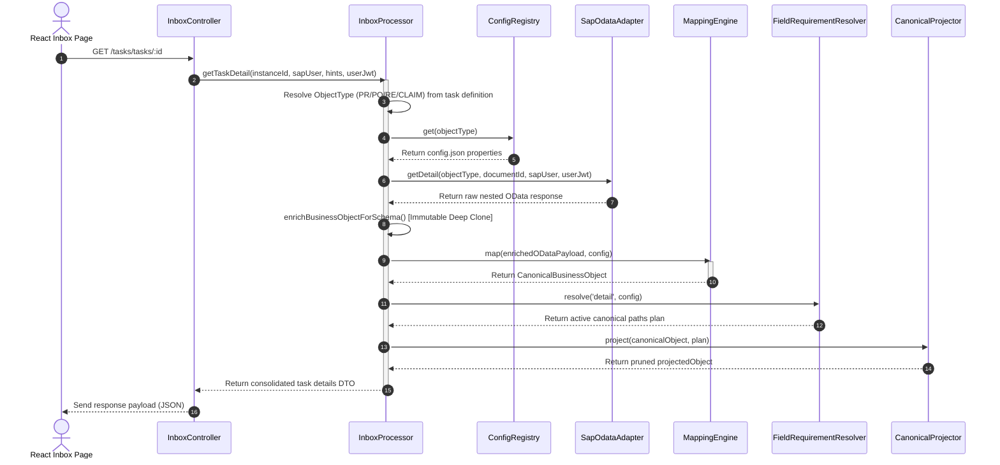

# Config-Driven API Mapping Architecture

> **Owner:** Lead CAP Architect & Lead Frontend Engineer | **Last Updated:** 2026-07-22 | **Status:** Active

This document describes the design, purposes, data flows, and configuration schemas of the **Config-Driven API Mapping Engine** implemented to refactor the CNMA Approval backend BFF integration layer.

---

## 1. Purposes & Design Philosophy

The refactoring addresses three core coupling problems in traditional SAP CAP BFF applications:
1. **Field Leakage:** SAP OData-specific field names (e.g., `PurchaseRequisition`, `CreationDate`) previously leaked into multiple layers: Express controllers, React components, and dynamic registries.
2. **Duplicate Network Roundtrips:** The UI previously triggered multiple concurrent HTTP requests (`/overview`, `/information`, `/workflow-approval-tree`, `/attachments`) upon opening a task. Several of these made duplicate calls to S/4HANA.
3. **Low Agility:** Renaming or replacing SAP OData endpoints forced modifications throughout the frontend hooks and UI renderers.

### The Decoupled Target
We introduce a **canonical business object representation** that acts as the single contract for the React frontend.
```
  [Raw OData Payload] ──> [Mapping Engine] ──> [Canonical DTO] ──> [React UI]
```
The React frontend depends *only* on the canonical properties (e.g., `header.documentNumber`, `workflow.steps`), while the backend uses declarative configuration files to map raw OData fields to the canonical model.

---

## 2. Core Architectural Components

The mapping engine is built with clean separation of concerns:

```
                  +-----------------------------------+
                  |          ConfigRegistry           |
                  |  Loads and validates config.json  |
                  +-----------------+-----------------+
                                    |
                                    v
+------------------+      +-------------------+      +--------------------------+
|  MappingEngine   | ---> |  Canonical Object  | ---> | FieldRequirementResolver |
| Maps Raw OData   |      |   Representation  |      | Generates projection path|
+------------------+      +-------------------+      +------------+-------------+
                                                                  |
                                                                  v
                                                     +--------------------------+
                                                     |    CanonicalProjector    |
                                                     |  Prunes unmapped fields  |
                                                     +--------------------------+
```

### 2.1 ConfigRegistry
* **Path:** [`srv/lib/mapping/config-registry.ts`](file:///d:/learning/test/cnma_approval/srv/lib/mapping/config-registry.ts)
* **Responsibility:** Scans and indexes JSON configurations under `srv/configuration/object-types/*/config.json` at startup.
* **Hot-Reloading Watcher:** In non-production modes, the registry monitors directory changes using `fs.watch`. It uses an **atomic swap** pattern: it re-validates changes before writing to memory. If the edit has invalid JSON syntax or fails validation, the swap is aborted, preserving the current active in-memory configurations.

### 2.2 MappingEngine
* **Path:** [`srv/lib/mapping/mapping-engine.ts`](file:///d:/learning/test/cnma_approval/srv/lib/mapping/mapping-engine.ts)
* **Responsibility:** Evaluates declarative `mappings` properties (root fields and collections) and maps raw SAP JSON into the nested canonical format. It supports data formatting transforms (e.g. converting epoch Unix dates to ISO strings, text capitalization).

### 2.3 FieldRequirementResolver
* **Path:** [`srv/lib/mapping/resolver.ts`](file:///d:/learning/test/cnma_approval/srv/lib/mapping/resolver.ts)
* **Responsibility:** Compiles all canonical paths required to serve a specific execution profile (e.g., `list` vs `detail`) by analyzing both UI schemas and profile rules.

### 2.4 CanonicalProjector
* **Path:** [`srv/lib/mapping/canonical-projector.ts`](file:///d:/learning/test/cnma_approval/srv/lib/mapping/canonical-projector.ts)
* **Responsibility:** Receives the resolved paths list and prunes any properties from the mapped object that are not listed in the plan, optimizing payload serialization sizes before sending to the client browser.

---

## 3. End-to-End Consolidated Data Flow

The sequence diagram below displays how a single frontend REST call is processed by the backend using the mapping engine:



---

## 4. Configuration Schema (`config.json`)

Each object type configuration is structured as follows:

```json
{
  "object": {
    "objectType": "PR",
    "displayName": "Purchase Requisition",
    "version": 1,
    "adapter": "PR_DETAIL",
    "aliases": ["BUS2105"],
    "enabledSections": {
      "header": true,
      "items": true,
      "workflow": true,
      "comments": true,
      "attachments": true
    }
  },
  "source": {
    "service": "APPROVAL_SRV",
    "rootEntity": "ZC_PRHEADER",
    "key": [
      { "name": "DocCategory", "value": "BUS2105" },
      { "name": "DocumentNumber", "fromContext": "documentId" }
    ],
    "navigations": {
      "items": "_Item",
      "comments": "_Comment"
    }
  },
  "mappings": {
    "root": [
      { "sourcePath": "purchaseRequisition", "targetPath": "header.purchaseRequisition", "type": "string", "required": true },
      { "sourcePath": "purReqCreationDate", "targetPath": "header.purReqCreationDate", "transform": "sapDateToIso" }
    ],
    "collections": {
      "items": {
        "navigationKey": "items",
        "targetPath": "items",
        "fields": [
          { "sourcePath": "requestedQuantity", "targetPath": "quantity", "transform": "number" }
        ]
      },
      "workflowSteps": {
        "navigationKey": "approvalTree",
        "targetPath": "workflow.steps",
        "fields": [
          { "sourcePath": "approver", "targetPath": "approver" },
          { "sourcePath": "status", "targetPath": "status" }
        ]
      }
    }
  },
  "uiSchema": {
    "title": "{{header.purchaseRequisition}}",
    "sections": [
      {
        "id": "basic",
        "type": "CARD",
        "title": "Basic Data",
        "fields": ["purchaseRequisition"]
      }
    ]
  },
  "profiles": {
    "list": {
      "requiredCanonicalPaths": ["header.purchaseRequisition"]
    },
    "detail": {
      "includeUiFields": true,
      "requiredCanonicalPaths": ["workflow.steps"]
    }
  }
}
```

---

## 5. Developer Guide: Adding a New Object Type

Follow these steps to add support for a new business object type (e.g. `CONTRACT` / `BUS2014`):

1. **Scaffold Configuration:**
   Create the directory `srv/configuration/object-types/contract/` and write a new `config.json` containing the required OData entities, navigation fields, UI schema layout, mappings, and profile paths.
2. **Implement Adapter Strategy:**
   Create a strategy class `ContractDetail` in `srv/lib/integrations/contract.ts` extending `BaseDetail` to run queries against the target OData service and return sub-entities:
   ```typescript
   export class ContractDetail extends BaseDetail {
       readonly objectType: ObjectTypeCode = 'CONTRACT';
       // Implement fetchSubEntities...
   }
   ```
3. **Register Adapter Strategy:**
   Register the new strategy inside `srv/lib/integrations/sap-odata-adapter.ts`:
   ```typescript
   import { ContractDetail } from './contract';
   // Register inside constructor:
   this.registerStrategy(new ContractDetail(this.sapClient, this.metadataService));
   ```
4. **Compile and Restart:**
   The `ConfigRegistry` will dynamically index the new configurations at launch. Start the server and visit the consolidated endpoint `/tasks/tasks/:id` to check the mapped payload.
