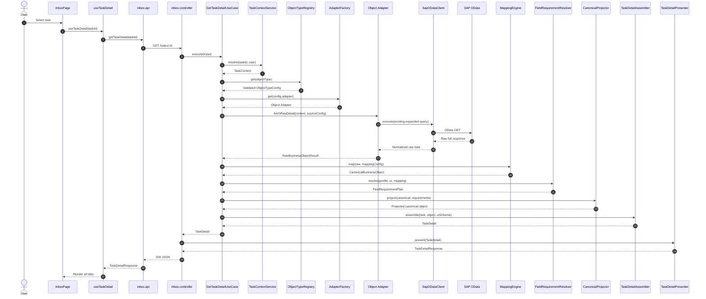

# Implementation Plan — Config-Driven API Mapping & Task Detail Flow Refactor

## 1. Purpose

Refactor the current task-detail API flow so that:

1. React calls one stable task-detail API instead of multiple overlapping endpoints.
2. SAP/OData field names are not hardcoded across controllers, processors, components, or business logic.
3. Each object type is described by external JSON configuration.
4. Raw SAP responses are mapped into one stable canonical model before being returned to React.
5. Mapping changes or replacement SAP APIs can be handled mainly by updating configuration and the relevant adapter.
6. The current iteration focuses on **mapping-first**, not immediately generating a full `$select` for every expanded entity.
7. The architecture is prepared to derive projected OData queries automatically in a later phase.

---

## 2. Current Problems

### 2.1 Duplicate API calls

When a user opens one task, the frontend currently calls several endpoints:

```text
GET /tasks/:id/overview
GET /tasks/:id/information
GET /tasks/:id
GET /tasks/:id/workflow-approval-tree
GET /pr/:documentNumber/attachments
```

Several backend handlers call the same processor and trigger the same heavy SAP detail request.

Effects:

- Duplicate SAP calls.
- Repeated mapping of the same payload.
- Multiple React loading states.
- Sequential rendering jumps.
- More files and hooks must be changed when the API contract changes.

### 2.2 SAP fields leak into multiple layers

SAP field names and object-specific conditions may appear in:

- OData query construction.
- Adapter mapping.
- Processor enrichment.
- UI field schema.
- React components.
- Fallback key arrays.
- Workflow and attachment mapping.
- Object-type conditional branches.

This makes field changes difficult to trace and maintain.

### 2.3 UI schema is mixed with backend data requirements

The UI schema describes what should be displayed, but the backend may also need fields for:

- Object identity.
- Routing.
- Authorization.
- Approve/reject actions.
- Currency and unit dependencies.
- Derived values.
- Navigation links.
- Workflow correlation.
- Attachment download.
- Logging and diagnostics.

Using only UI fields as the backend source-field definition is unsafe.

### 2.4 Current pruning happens too late

Pruning after receiving the full SAP response can reduce the CAP-to-browser payload, but it does not reduce:

- SAP query work.
- SAP serialization.
- SAP-to-CAP payload.
- CAP parsing of the full response.

This plan therefore separates:

```text
Mapping and canonicalization — current implementation priority
Query projection and $select optimization — later controlled phase
```

---

## 3. Confirmed Design Decisions

### 3.1 Mapping-first approach

The first refactor will:

1. Keep the existing SAP detail call functional.
2. Map the raw SAP response into a canonical model through JSON configuration.
3. Make React depend only on canonical fields.
4. Consolidate duplicate frontend API calls.
5. Validate that all object types render correctly.
6. Generate a field-requirement plan from configuration for diagnostics.
7. Defer actual `$select` injection until mappings are stable.

### 3.2 No SAP field names in React

React must only use canonical paths such as:

```text
header.documentNumber
header.createdAt
header.totalAmount
header.currency
items[].itemNumber
items[].material
workflow.steps[]
attachments[]
```

React must not use source names such as:

```text
PurchaseRequisition
PurchaseRequisitionItem
CreationDate
DocumentCurrency
_ApprovalStep
_Attachment
```

### 3.3 JSON configuration is the source of mapping truth

Object-specific field definitions will live in JSON files, not in generic TypeScript business logic.

TypeScript code will contain:

- Generic configuration loading.
- Generic mapping algorithms.
- Generic validation.
- Generic orchestration.
- Reusable transforms.
- Adapter interfaces.

Object-specific JSON will contain:

- Source service and entity configuration.
- Navigation names.
- Source-to-canonical mapping.
- UI metadata.
- Required runtime fields.
- Profile and section rules.

### 3.4 One frontend call does not require one SAP call forever

The frontend contract will be:

```http
GET /api/cnma/APPROVAL_SRV/tasks/:taskId
```

Initially, the backend can continue using one existing expanded SAP request.

Later, the backend may internally use:

- One projected request.
- Several section requests in parallel.
- OData `$batch`.
- A fallback when generated URLs are too long.

These transport decisions must not change the React contract.

### 3.5 Attachment binary is not part of task detail

The consolidated detail response may include attachment metadata:

```text
id
fileName
mimeType
fileSize
createdAt
createdBy
```

The actual file content must be loaded by a separate content/download endpoint.

---

## 4. Scope

## 4.1 In scope for the current refactor

- Refactor backend folder structure.
- Add configuration directories and JSON files per object type.
- Introduce canonical task-detail models.
- Add JSON configuration validation.
- Add object-type registry.
- Add generic mapping engine.
- Add reusable transform registry.
- Add automatic canonical field requirement resolver.
- Consolidate frontend detail queries.
- Reassign responsibilities across controller, use case, adapter, mapper, assembler, and presenter.
- Preserve existing SAP query behavior during the first rollout.
- Add tests for configuration, mapping, API contract, and React rendering.
- Add observability and performance baseline measurements.
- Prepare a future projection plan without applying `$select` immediately.

## 4.2 Explicitly out of scope for the first rollout

- Manually maintaining `$select` lists for every expanded entity.
- Enabling generated `$select` for all object types immediately.
- Replacing every SAP service.
- Redesigning SAP CDS views.
- Returning attachment binary in the detail response.
- Allowing React to send arbitrary SAP fields.
- Allowing executable expressions or arbitrary JavaScript inside JSON configuration.
- Removing legacy endpoints before compatibility testing is complete.

---

## 5. Target Architecture

```mermaid
flowchart LR
    UI[React Inbox UI]
    Hook[useTaskDetail]
    API[inbox.api.ts]
    Ctrl[Task Detail Controller]
    UC[GetTaskDetailUseCase]
    Context[TaskContextService]
    Registry[ObjectTypeRegistry]
    Factory[BusinessObjectAdapterFactory]
    Adapter[PR / PO / Other Adapter]
    Client[SapODataClient]
    SAP[SAP OData]
    Mapping[MappingEngine]
    Resolver[FieldRequirementResolver]
    Projector[CanonicalProjector]
    Assembler[TaskDetailAssembler]
    Presenter[TaskDetailPresenter]
    DTO[Stable TaskDetailResponse]

    UI --> Hook
    Hook --> API
    API --> Ctrl
    Ctrl --> UC
    UC --> Context
    UC --> Registry
    Registry --> Factory
    Factory --> Adapter
    Adapter --> Client
    Client --> SAP
    SAP --> Client
    Client --> Adapter
    Adapter --> Mapping
    Registry --> Mapping
    Registry --> Resolver
    Mapping --> Projector
    Resolver --> Projector
    Projector --> Assembler
    Assembler --> Presenter
    Presenter --> DTO
    DTO --> API
    API --> UI
```



### Core separation

```text
Controller
    Receives HTTP input and returns HTTP output.

Use case
    Orchestrates the task-detail operation.

Task context service
    Resolves task metadata, object type, document ID, and user context.

Object-type registry
    Loads validated JSON configuration.

Adapter
    Knows how to fetch raw data for one object type or source API.

SAP client
    Handles destination, JWT, HTTP, timeout, retry, and tracing.

Mapping engine
    Maps raw source data to canonical data using mapping JSON.

Field requirement resolver
    Determines canonical fields required by UI and runtime rules.

Canonical projector
    Removes canonical fields that are not part of the selected response profile.

Assembler
    Combines task, object, workflow, comments, attachments, and warnings.

Presenter
    Produces the stable public API DTO.
```

---

## 6. Proposed Folder Structure

The exact root can be adjusted to the project, but responsibilities should follow this structure.

```text
srv/
├── api/
│   └── approval-service.cds
│
├── presentation/
│   ├── controllers/
│   │   └── inbox-controller.ts
│   ├── presenters/
│   │   └── task-detail.presenter.ts
│   └── dto/
│       ├── task-detail-response.dto.ts
│       └── api-warning.dto.ts
│
├── application/
│   ├── use-cases/
│   │   └── get-task-detail.use-case.ts
│   ├── services/
│   │   ├── task-context.service.ts
│   │   ├── task-detail-assembler.ts
│   │   └── section-error-policy.ts
│   └── ports/
│       ├── business-object-adapter.port.ts
│       ├── task-repository.port.ts
│       └── object-type-registry.port.ts
│
├── domain/
│   ├── models/
│   │   ├── canonical-business-object.ts
│   │   ├── task-detail.ts
│   │   ├── workflow.ts
│   │   ├── comment.ts
│   │   └── attachment.ts
│   ├── types/
│   │   ├── object-type.ts
│   │   ├── canonical-path.ts
│   │   └── response-profile.ts
│   └── errors/
│       ├── unsupported-object-type.error.ts
│       ├── mapping.error.ts
│       └── configuration.error.ts
│
├── configuration/
│   ├── loader/
│   │   ├── json-object-config-loader.ts
│   │   ├── object-type-registry.ts
│   │   └── config-cache.ts
│   ├── validation/
│   │   ├── config-validator.ts
│   │   └── schemas/
│   │       ├── object.schema.json
│   │       ├── source.schema.json
│   │       ├── mapping.schema.json
│   │       ├── ui-schema.schema.json
│   │       └── profiles.schema.json
│   └── object-types/
│       ├── pr/
│       │   ├── object.json
│       │   ├── source.json
│       │   ├── mapping.json
│       │   ├── profiles.json
│       │   └── ui-schema.json
│       ├── po/
│       │   ├── object.json
│       │   ├── source.json
│       │   ├── mapping.json
│       │   ├── profiles.json
│       │   └── ui-schema.json
│       └── reservation/
│           ├── object.json
│           ├── source.json
│           ├── mapping.json
│           ├── profiles.json
│           └── ui-schema.json
│
├── mapping/
│   ├── mapping-engine.ts
│   ├── mapping-index.ts
│   ├── field-requirement-resolver.ts
│   ├── canonical-projector.ts
│   ├── source-field-plan.ts
│   ├── path-reader.ts
│   ├── path-writer.ts
│   ├── collection-mapper.ts
│   ├── transform-registry.ts
│   └── transforms/
│       ├── identity.transform.ts
│       ├── sap-date-to-iso.transform.ts
│       ├── sap-time-to-iso.transform.ts
│       ├── number.transform.ts
│       ├── boolean.transform.ts
│       └── combine-name.transform.ts
│
├── infrastructure/
│   ├── sap/
│   │   ├── client/
│   │   │   ├── sap-odata-client.ts
│   │   │   ├── sap-request-context.ts
│   │   │   └── sap-response-normalizer.ts
│   │   ├── adapters/
│   │   │   ├── base-business-object.adapter.ts
│   │   │   ├── pr-detail.adapter.ts
│   │   │   ├── po-detail.adapter.ts
│   │   │   └── reservation-detail.adapter.ts
│   │   ├── factory/
│   │   │   └── business-object-adapter.factory.ts
│   │   └── query/
│   │       ├── existing-query-builder.ts
│   │       ├── projection-plan-builder.ts
│   │       └── url-length-estimator.ts
│   └── repositories/
│       └── cap-task.repository.ts
│
├── compatibility/
│   ├── legacy-inbox-processor.facade.ts
│   └── legacy-detail-response.mapper.ts
│
└── tests/
    ├── unit/
    │   ├── configuration/
    │   ├── mapping/
    │   ├── application/
    │   └── presentation/
    ├── contract/
    │   ├── pr-task-detail.contract.test.ts
    │   └── po-task-detail.contract.test.ts
    ├── fixtures/
    │   ├── pr/
    │   │   ├── raw-detail.json
    │   │   └── expected-canonical.json
    │   └── po/
    └── integration/
        └── task-detail.integration.test.ts
```

### Frontend target structure

```text
app/cnma_approval_ui/src/
├── features/
│   └── inbox/
│       ├── api/
│       │   └── inbox.api.ts
│       ├── hooks/
│       │   └── useTaskDetail.ts
│       ├── models/
│       │   ├── task-detail-response.ts
│       │   └── canonical-business-object.ts
│       ├── pages/
│       │   └── InboxPage.tsx
│       ├── components/
│       │   ├── TaskDetailView.tsx
│       │   ├── OverviewPanel.tsx
│       │   ├── InformationPanel.tsx
│       │   ├── WorkflowApprovalPanel.tsx
│       │   ├── CommentsPanel.tsx
│       │   └── AttachmentsPanel.tsx
│       └── selectors/
│           ├── task-detail.selectors.ts
│           └── field-value.selector.ts
│
└── shared/
    ├── api/
    │   └── api-client.ts
    └── components/
        └── DynamicFieldRenderer.tsx
```

---

## 7. Configuration Design

## 7.1 Configuration principles

1. JSON files contain declarative metadata only.
2. No `eval`, inline JavaScript, or executable expressions.
3. Transform names reference functions registered in TypeScript.
4. All JSON files are validated at application startup.
5. Invalid configuration should fail startup in non-production validation and block deployment tests.
6. Configuration is cached after loading.
7. Every object type has a configuration version.
8. UI schemas use canonical paths only.
9. Mapping files define the relationship between SAP source paths and canonical target paths.
10. Profile resolution derives field requirements automatically instead of duplicating source-field lists.

---

## 7.2 `object.json`

Purpose:

- Identify the object type.
- Select the adapter.
- Declare configuration version.
- Declare enabled sections.
- Define aliases.

Example:

```json
{
  "objectType": "PR",
  "displayName": "Purchase Requisition",
  "version": 1,
  "adapter": "PR_DETAIL",
  "aliases": ["BUS2105"],
  "sections": {
    "header": true,
    "items": true,
    "workflow": true,
    "comments": true,
    "attachments": true,
    "accountAssignments": true,
    "scheduleLines": false
  },
  "defaultProfile": "detail"
}
```

The generic registry reads this file. Generic code must not contain:

```typescript
if (objectType === 'PR') { ... }
```

Object-type selection is resolved through the registry and adapter factory.

---

## 7.3 `source.json`

Purpose:

- Describe the SAP service and root entity.
- Define how task context maps to OData keys.
- Define source navigation names.
- Keep source naming outside generic processing code.

Example:

```json
{
  "service": "APPROVAL_SRV",
  "protocol": "odata-v4",
  "rootEntity": "ZC_PRHEADER",
  "key": [
    {
      "name": "DocCategory",
      "value": "BUS2105"
    },
    {
      "name": "DocumentNumber",
      "fromContext": "documentId"
    }
  ],
  "navigations": {
    "items": "_Item",
    "workflowSteps": "_ApprovalStep",
    "headerTexts": "_HeaderText",
    "comments": "_Comment",
    "attachments": "_Attachment",
    "accountAssignments": "_AccountAssignment",
    "scheduleLines": "_ScheduleLine"
  },
  "initialFetch": {
    "mode": "existing-expanded-query",
    "include": [
      "items",
      "workflowSteps",
      "headerTexts",
      "comments",
      "attachments"
    ]
  }
}
```

For the first rollout, `initialFetch.mode` preserves the existing expanded request.

Later values may include:

```text
generated-projection
parallel-sections
batch
```

The use case must not care which mode is active.

---

## 7.4 `mapping.json`

Purpose:

- Define raw SAP source fields.
- Define canonical target fields.
- Define collection mapping.
- Define required fields and transforms.
- Provide enough information for automatic source-field derivation later.

Recommended structure:

```json
{
  "root": [
    {
      "sourcePath": "PurchaseRequisition",
      "targetPath": "header.documentNumber",
      "type": "string",
      "required": true,
      "usage": ["identity", "display", "action"]
    },
    {
      "sourcePath": "PurchaseRequisitionType",
      "targetPath": "header.documentType",
      "type": "string",
      "usage": ["display"]
    },
    {
      "sourcePath": "CreationDate",
      "targetPath": "header.createdAt",
      "transform": "sapDateToIso",
      "usage": ["display", "sorting"]
    },
    {
      "sourcePath": "TotalNetAmount",
      "targetPath": "header.totalAmount",
      "transform": "number",
      "dependencies": ["DocumentCurrency"],
      "usage": ["display"]
    },
    {
      "sourcePath": "DocumentCurrency",
      "targetPath": "header.currency",
      "type": "string",
      "usage": ["display", "dependency"]
    }
  ],
  "collections": {
    "items": {
      "sourceNavigation": "items",
      "targetPath": "items",
      "fields": [
        {
          "sourcePath": "PurchaseRequisitionItem",
          "targetPath": "itemNumber",
          "type": "string",
          "required": true,
          "usage": ["identity", "display", "action"]
        },
        {
          "sourcePath": "Material",
          "targetPath": "material",
          "type": "string",
          "usage": ["display"]
        },
        {
          "sourcePath": "PurchaseRequisitionItemText",
          "targetPath": "description",
          "type": "string",
          "usage": ["display"]
        },
        {
          "sourcePath": "RequestedQuantity",
          "targetPath": "quantity",
          "transform": "number",
          "dependencies": ["BaseUnit"],
          "usage": ["display"]
        },
        {
          "sourcePath": "BaseUnit",
          "targetPath": "unit",
          "type": "string",
          "usage": ["display", "dependency"]
        }
      ]
    },
    "workflow": {
      "sourceNavigation": "workflowSteps",
      "targetPath": "workflow.steps",
      "fields": [
        {
          "sourcePath": "StepNumber",
          "targetPath": "stepNumber",
          "transform": "number"
        },
        {
          "sourcePath": "Approver",
          "targetPath": "approver"
        },
        {
          "sourcePath": "ApprovalStatus",
          "targetPath": "status"
        }
      ]
    },
    "comments": {
      "sourceNavigation": "comments",
      "targetPath": "workflow.comments",
      "fields": [
        {
          "sourcePath": "NoteText",
          "targetPath": "text"
        },
        {
          "sourcePath": "CreatedBy",
          "targetPath": "author"
        },
        {
          "sourcePath": "PostedOn",
          "targetPath": "postedOn",
          "transform": "sapDateToIso"
        },
        {
          "sourcePath": "PostedTime",
          "targetPath": "postedTime",
          "transform": "sapTimeToIso"
        }
      ]
    },
    "attachments": {
      "sourceNavigation": "attachments",
      "targetPath": "attachments",
      "fields": [
        {
          "sourcePath": "AttachmentId",
          "targetPath": "id",
          "required": true,
          "usage": ["identity", "download"]
        },
        {
          "sourcePath": "FileName",
          "targetPath": "fileName",
          "usage": ["display", "download"]
        },
        {
          "sourcePath": "MimeType",
          "targetPath": "mimeType",
          "usage": ["display", "download"]
        },
        {
          "sourcePath": "FileSize",
          "targetPath": "fileSize",
          "transform": "number",
          "usage": ["display"]
        }
      ]
    }
  }
}
```

### Why this file is central

This file lets the system build two indexes:

```text
Source path → canonical target path
Canonical target path → source path and dependencies
```

Example:

```text
header.totalAmount
    → TotalNetAmount
    → dependency: DocumentCurrency

items.quantity
    → _Item.RequestedQuantity
    → dependency: _Item.BaseUnit
```

This is the basis for automatic mapping now and automatic query projection later.

---

## 7.5 `ui-schema.json`

Purpose:

- Define rendering metadata.
- Refer only to canonical paths.
- Avoid SAP source names.
- Allow different fields per object type.

Example:

```json
{
  "header": {
    "titlePath": "header.documentNumber",
    "subtitlePath": "header.documentTypeText"
  },
  "sections": [
    {
      "id": "overview",
      "label": "Overview",
      "fields": [
        {
          "id": "documentNumber",
          "dataPath": "header.documentNumber",
          "label": "Document Number",
          "component": "text"
        },
        {
          "id": "createdAt",
          "dataPath": "header.createdAt",
          "label": "Created On",
          "component": "date"
        },
        {
          "id": "totalAmount",
          "dataPath": "header.totalAmount",
          "label": "Total Amount",
          "component": "amount",
          "currencyPath": "header.currency"
        }
      ]
    },
    {
      "id": "items",
      "label": "Items",
      "type": "table",
      "collectionPath": "items",
      "columns": [
        {
          "id": "itemNumber",
          "dataPath": "itemNumber",
          "label": "Item"
        },
        {
          "id": "material",
          "dataPath": "material",
          "label": "Material"
        },
        {
          "id": "quantity",
          "dataPath": "quantity",
          "label": "Quantity",
          "unitPath": "unit"
        }
      ]
    }
  ],
  "cardChips": [
    {
      "id": "documentType",
      "dataPath": "header.documentTypeText"
    },
    {
      "id": "amount",
      "dataPath": "header.totalAmount",
      "companionPath": "header.currency"
    }
  ]
}
```

The UI schema no longer determines SAP field names. It only describes canonical data.

---

## 7.6 `profiles.json`

Purpose:

- Define response profiles without duplicating SAP field lists.
- Tell the resolver where to collect canonical field requirements.
- Add hidden runtime requirements.

Example:

```json
{
  "profiles": {
    "summary": {
      "includeUiSources": [
        "header",
        "cardChips"
      ],
      "includeSections": [
        "header"
      ],
      "requiredCanonicalPaths": [
        "header.documentNumber",
        "header.documentType",
        "header.createdAt"
      ]
    },
    "detail": {
      "includeUiSources": [
        "header",
        "sections",
        "cardChips"
      ],
      "includeSections": [
        "header",
        "items",
        "workflow",
        "comments",
        "attachments"
      ],
      "requiredCanonicalPaths": [
        "header.documentNumber",
        "header.documentType",
        "header.currency"
      ],
      "requiredUsageTags": [
        "identity",
        "action",
        "download",
        "dependency"
      ]
    }
  }
}
```

### Automatic resolution process

For the `detail` profile, the resolver will:

1. Read canonical paths from `ui-schema.json`.
2. Add `requiredCanonicalPaths`.
3. Add mappings tagged with required usage tags.
4. Add dependencies from `mapping.json`.
5. Validate that every canonical path has a source mapping.
6. Produce a `FieldRequirementPlan`.

Example generated plan:

```json
{
  "profile": "detail",
  "canonicalPaths": [
    "header.documentNumber",
    "header.createdAt",
    "header.totalAmount",
    "header.currency",
    "items.itemNumber",
    "items.material",
    "items.quantity",
    "items.unit"
  ],
  "sourceGroups": {
    "root": [
      "PurchaseRequisition",
      "CreationDate",
      "TotalNetAmount",
      "DocumentCurrency"
    ],
    "items": [
      "PurchaseRequisitionItem",
      "Material",
      "RequestedQuantity",
      "BaseUnit"
    ]
  }
}
```

For the initial rollout this plan is used for:

- Validation.
- Diagnostics.
- Canonical response pruning.
- Missing-field detection.
- Future query projection preparation.

It is **not yet injected into the SAP URL**.

---

## 8. Canonical Domain Model

The public model should be stable across PR, PO, Reservation, Claim, and future object types.

```typescript
export interface CanonicalBusinessObject {
  objectType: string;
  objectId: string;

  header: Record<string, unknown>;
  items: Array<Record<string, unknown>>;

  workflow: {
    strategyName?: string;
    steps: ApprovalStep[];
    comments: Comment[];
  };

  attachments: AttachmentMetadata[];

  accountAssignments?: Array<Record<string, unknown>>;
  scheduleLines?: Array<Record<string, unknown>>;
}
```

Recommended stable API response:

```typescript
export interface TaskDetailResponse {
  task: {
    id: string;
    status?: string;
    title?: string;
    priority?: string;
    createdAt?: string;
  };

  object: CanonicalBusinessObject;

  uiSchema: UiSchema;

  metadata: {
    objectType: string;
    configurationVersion: number;
    profile: string;
    mappingWarnings?: MappingWarning[];
  };

  warnings?: ApiWarning[];
}
```

Example JSON:

```json
{
  "task": {
    "id": "198781",
    "status": "READY",
    "priority": "HIGH",
    "createdAt": "2026-07-21T08:00:00Z"
  },
  "object": {
    "objectType": "PR",
    "objectId": "0010001741",
    "header": {
      "documentNumber": "0010001741",
      "documentType": "ZASS",
      "createdAt": "2026-07-18",
      "totalAmount": 2500,
      "currency": "USD"
    },
    "items": [],
    "workflow": {
      "strategyName": "PR_STANDARD",
      "steps": [],
      "comments": []
    },
    "attachments": []
  },
  "uiSchema": {},
  "metadata": {
    "objectType": "PR",
    "configurationVersion": 1,
    "profile": "detail"
  }
}
```

### Avoid duplicate data paths

Do not return the same data in multiple locations such as:

```text
businessContext.pr.approvalTree
workflowApprovalTree.steps

businessContext.pr.comments
comments
workflowApprovalTree.comments

businessContext.pr.attachments
attachments
```

Canonical ownership should be:

```text
object.header
object.items
object.workflow.steps
object.workflow.comments
object.attachments
```

---

## 9. Backend Responsibility Refactor

## 9.1 `inbox-controller.ts`

### Current risk

The controller may contain route-specific mapping and call processor methods that repeat the same detail fetch.

### Target responsibility

The controller should only:

1. Read HTTP parameters.
2. Read authenticated user/JWT context.
3. Call one use case.
4. Convert known errors to HTTP status.
5. Return the presenter result.

Example:

```typescript
export async function getTaskDetail(req: Request, res: Response) {
  const result = await getTaskDetailUseCase.execute({
    taskId: req.params.id,
    profile: 'detail',
    sapUser: req.user?.id,
    userJwt: req.authInfo?.getTokenInfo()?.getTokenValue()
  });

  return res.status(200).json(taskDetailPresenter.present(result));
}
```

The controller must not:

- Know SAP entity names.
- Know object-specific fields.
- Parse expanded collections.
- Build workflow trees.
- Prune fields.
- Choose PR or PO mapping manually.

---

## 9.2 `get-task-detail.use-case.ts`

Target responsibility:

1. Validate task ID.
2. Resolve task context.
3. Load object configuration.
4. Resolve the adapter.
5. Fetch raw SAP detail.
6. Map raw data into canonical form.
7. Resolve required canonical fields.
8. Project the canonical response.
9. Assemble task detail.
10. Return domain result.

Pseudo-code:

```typescript
export class GetTaskDetailUseCase {
  async execute(input: GetTaskDetailInput): Promise<TaskDetail> {
    const context = await this.taskContextService.resolve(input);

    const config = this.objectTypeRegistry.get(context.objectType);

    const adapter = this.adapterFactory.get(config.object.adapter);

    const rawResult = await adapter.fetchRawDetail({
      context,
      source: config.source
    });

    const canonicalObject = this.mappingEngine.map({
      raw: rawResult.data,
      mapping: config.mapping,
      context
    });

    const requirements = this.fieldRequirementResolver.resolve({
      profile: input.profile ?? config.object.defaultProfile,
      uiSchema: config.uiSchema,
      profiles: config.profiles,
      mapping: config.mapping
    });

    const projectedObject = this.canonicalProjector.project({
      object: canonicalObject,
      requirements
    });

    return this.taskDetailAssembler.assemble({
      context,
      object: projectedObject,
      uiSchema: config.uiSchema,
      configurationVersion: config.object.version,
      warnings: rawResult.warnings
    });
  }
}
```

The use case must not contain PR/PO field names.

---

## 9.3 `task-context.service.ts`

Target responsibility:

- Load the task.
- Resolve task ID, instance ID/document ID, object type, status, and user context.
- Normalize object-type aliases.

Example:

```typescript
export interface TaskContext {
  taskId: string;
  documentId: string;
  objectType: string;
  task: TaskMetadata;
  sapUser?: string;
  userJwt?: string;
}
```

It must not fetch SAP business-object details.

---

## 9.4 `object-type-registry.ts`

Target responsibility:

- Load all object-type directories.
- Validate all JSON files.
- Build alias indexes.
- Cache configurations.
- Return immutable configuration objects.

Example calls:

```typescript
registry.get('PR');
registry.getByAlias('BUS2105');
registry.has('PO');
registry.list();
```

Startup validation should detect:

- Duplicate object types.
- Duplicate aliases.
- Unknown adapters.
- Missing source navigation.
- Duplicate target paths.
- Missing target mapping for UI paths.
- Unknown transform names.
- Circular dependencies.
- Invalid profile sections.

---

## 9.5 `business-object-adapter.factory.ts`

Target responsibility:

- Map adapter keys from `object.json` to adapter instances.

Example:

```typescript
const adapters = new Map<string, BusinessObjectAdapter>([
  ['PR_DETAIL', prDetailAdapter],
  ['PO_DETAIL', poDetailAdapter],
  ['RESERVATION_DETAIL', reservationDetailAdapter]
]);
```

Generic code selects by configuration:

```typescript
const adapter = factory.get(config.object.adapter);
```

No controller-level object-type switch is required.

---

## 9.6 Object-specific adapters

Files:

```text
pr-detail.adapter.ts
po-detail.adapter.ts
reservation-detail.adapter.ts
```

Target responsibility:

- Build the current SAP request from `source.json`.
- Call `SapODataClient`.
- Normalize response envelopes.
- Return raw source data.
- Apply only source-specific transport corrections.

Adapters must not:

- Produce React DTOs.
- Read UI schema.
- Format labels.
- Contain canonical response pruning.
- Duplicate generic mapping logic.

Initial interface:

```typescript
export interface BusinessObjectAdapter {
  fetchRawDetail(
    input: FetchRawDetailInput
  ): Promise<RawBusinessObjectResult>;
}
```

Later interface extension:

```typescript
fetchProjectedDetail(
  input: FetchProjectedDetailInput
): Promise<RawBusinessObjectResult>;
```

---

## 9.7 `sap-odata-client.ts`

Target responsibility:

- Resolve destination.
- Forward JWT/principal propagation.
- Perform HTTP request.
- Handle headers.
- Apply timeout.
- Normalize errors.
- Add correlation ID.
- Record duration and response size.
- Support cancellation where possible.

It must not know:

- PR/PO field mappings.
- UI fields.
- Canonical models.
- Which tabs exist in React.

---

## 9.8 `mapping-engine.ts`

Target responsibility:

- Map raw root fields.
- Map configured collections.
- Apply registered transforms.
- Write values to canonical target paths.
- Enforce required-field policy.
- Collect mapping warnings.
- Avoid object-type-specific branching.

Pseudo-code:

```typescript
const result = mappingEngine.map({
  raw,
  mapping,
  context
});
```

Internal flow:

```text
Map root entries
    ↓
Resolve each sourcePath
    ↓
Apply transform
    ↓
Write targetPath
    ↓
Map each configured collection
    ↓
Collect warnings and missing required fields
```

---

## 9.9 `transform-registry.ts`

Transforms are implemented in code because they contain behavior, but JSON references them by stable names.

Example registry:

```typescript
const transforms = {
  identity,
  sapDateToIso,
  sapTimeToIso,
  number,
  boolean,
  combineName
};
```

JSON:

```json
{
  "sourcePath": "CreationDate",
  "targetPath": "header.createdAt",
  "transform": "sapDateToIso"
}
```

Rules:

- Transforms must be pure where possible.
- Transforms must be unit-tested.
- Unknown transforms fail configuration validation.
- Avoid embedding object-specific field lists in transforms.
- A transform may receive source value, dependencies, and read-only context.

---

## 9.10 `field-requirement-resolver.ts`

This is the key component for the mapping-first strategy.

Target responsibility:

1. Read canonical field paths from UI schema.
2. Read profile-required canonical paths.
3. Include mappings by usage tags.
4. Resolve companion paths such as currency and unit.
5. Resolve mapping dependencies.
6. Validate target paths against the mapping index.
7. Group corresponding source fields by root/navigation.
8. Return a reusable requirement plan.

It must not initially modify the SAP query.

Example output type:

```typescript
export interface FieldRequirementPlan {
  profile: string;
  canonicalPaths: Set<string>;
  sourceGroups: Record<string, Set<string>>;
  missingMappings: string[];
  dependencyGraph: Record<string, string[]>;
}
```

This prevents manually maintaining:

```text
HeaderSelectFields
ItemSelectFields
WorkflowSelectFields
AttachmentSelectFields
```

in TypeScript.

---

## 9.11 `canonical-projector.ts`

Target responsibility:

- Return only canonical fields required by the selected profile.
- Preserve stable structural containers.
- Never inspect SAP field names.
- Keep required runtime metadata.

Example preserved structure:

```json
{
  "header": {},
  "items": [],
  "workflow": {
    "steps": [],
    "comments": []
  },
  "attachments": []
}
```

This replaces the fragile behavior of:

```typescript
dataPath.startsWith('$.header.')
substring(9)
criticalHeaderKeys
criticalItemKeys
```

---

## 9.12 `task-detail-assembler.ts`

Target responsibility:

- Combine task metadata and canonical object.
- Attach UI schema.
- Attach configuration version.
- Attach warnings.
- Ensure workflow/comments/attachments have one canonical location.

It must not map SAP fields.

---

## 9.13 `task-detail.presenter.ts`

Target responsibility:

- Convert domain result to API DTO.
- Normalize undefined values.
- Ensure dates and warnings follow the public contract.
- Hide internal diagnostics in production if required.

It must not call SAP or inspect object type.

---

## 10. New Backend Call Flow



### Important first-rollout behavior

```text
SAP query:
    Existing full expanded query remains temporarily.

Mapping:
    Completely refactored to config-driven canonical mapping.

Response:
    Canonical and profile-projected.

Future:
    FieldRequirementPlan becomes input for generated $select/$expand.
```

---

## 11. Frontend Refactor

## 11.1 `inbox.api.ts`

Keep only the consolidated detail request for task detail:

```typescript
export async function getTaskDetail(
  taskId: string,
  options?: { signal?: AbortSignal }
): Promise<TaskDetailResponse> {
  return apiClient.get(
    `/api/cnma/APPROVAL_SRV/tasks/${encodeURIComponent(taskId)}`,
    { signal: options?.signal }
  );
}
```

Legacy API functions should be marked deprecated:

```typescript
/** @deprecated Use getTaskDetail */
getTaskOverview();

/** @deprecated Use getTaskDetail */
getTaskInformation();

/** @deprecated Use getTaskDetail */
getWorkflowApprovalTree();

/** @deprecated Read attachment metadata from TaskDetailResponse */
getPrAttachments();
```

Delete them only after the migration window.

---

## 11.2 `useTaskDetail.ts`

Target behavior:

- Query key includes task ID.
- Disable query when no task is selected.
- Pass abort signal.
- Avoid stale response overwriting a newer task.
- Cache briefly to avoid repeat calls when switching tabs.

Example:

```typescript
export function useTaskDetail(taskId?: string) {
  return useQuery({
    queryKey: ['task-detail', taskId],
    queryFn: ({ signal }) =>
      inboxApi.getTaskDetail(taskId!, { signal }),
    enabled: Boolean(taskId),
    staleTime: 30_000
  });
}
```

---

## 11.3 `InboxPage.tsx`

Replace:

```text
useTaskOverview
useTaskInformation
useTaskDetail
detail prefetch timer
secondary loading timer
```

with:

```typescript
const taskDetailQuery = useTaskDetail(selectedTaskId);
const detail = taskDetailQuery.data;
```

Use the selected task from the inbox list as an immediate summary while detail loads:

```typescript
const initialSummary = selectedTask;
```

Recommended UI behavior:

```text
Task clicked
    ↓
Render existing list summary immediately
    ↓
Show skeleton for detailed sections
    ↓
Merge canonical detail response
```

This avoids bringing back a duplicate overview endpoint.

---

## 11.4 `TaskDetailView.tsx`

Remove:

```text
useWorkflowApprovalTree
usePrAttachments
```

Read:

```typescript
const object = detail?.object;
const workflow = object?.workflow;
const comments = object?.workflow?.comments ?? [];
const attachments = object?.attachments ?? [];
```

Pass canonical data into panels.

---

## 11.5 Dynamic field rendering

`DynamicFieldRenderer` must read canonical `dataPath` values from `uiSchema`.

Example:

```typescript
const value = getCanonicalValue(
  detail.object,
  field.dataPath
);
```

The renderer must not include object-type-specific field switches unless behavior, not data mapping, genuinely differs.

---

## 12. Legacy Compatibility Strategy

Removing all old endpoints immediately is risky. Use a staged migration.

### Stage A — New flow available

Add the new canonical `/tasks/:id` response behind a feature flag:

```text
TASK_DETAIL_V2_ENABLED=true
```

### Stage B — Old endpoints delegate to new use case

Example:

```typescript
getTaskOverview(id)
    → GetTaskDetailUseCase.execute(id)
    → LegacyDetailResponseMapper.toOverview(result)
```

This avoids duplicate SAP calls within one handler and keeps compatibility temporarily.

### Stage C — Frontend switches to the new response

- Replace hooks.
- Remove timer logic.
- Verify all tabs.
- Monitor missing mapping warnings.

### Stage D — Remove old frontend APIs

Delete unused hooks and API functions.

### Stage E — Remove backend legacy endpoints

Remove routes after consumers are confirmed migrated.

### Stage F — Remove `legacy-inbox-processor.facade.ts`

Only after no external consumer depends on the old processor methods.

---

## 13. Mapping Error Policy

## 13.1 Startup errors

Fail startup or deployment validation for:

- Invalid JSON.
- JSON schema validation failure.
- Duplicate object type.
- Duplicate canonical target path.
- Unknown adapter.
- Unknown transform.
- UI canonical path without mapping.
- Invalid collection navigation.
- Circular dependency.
- Missing required config file.

## 13.2 Runtime errors

### Required source field missing

Default:

```text
Fail the affected object mapping with a typed MappingError.
```

Optional compatibility mode:

```text
Return the object with a warning during rollout.
```

### Optional source field missing

Return:

```json
{
  "code": "OPTIONAL_SOURCE_FIELD_MISSING",
  "objectType": "PR",
  "sourcePath": "SomeOptionalField",
  "targetPath": "header.someOptionalValue"
}
```

Do not expose sensitive raw payload values.

### Optional section failed

For example, workflow is unavailable but header and items succeed:

```json
{
  "warnings": [
    {
      "section": "workflow",
      "code": "SECTION_UNAVAILABLE",
      "message": "Workflow data could not be loaded."
    }
  ]
}
```

This section-level fallback becomes more relevant when SAP requests are split in a future phase.

---

## 14. Configuration Validation

Use JSON Schema validation for each configuration file.

Validation should run:

```text
Local startup
Unit tests
CI pipeline
Application startup
```

Add a script:

```json
{
  "scripts": {
    "validate:object-config": "tsx scripts/validate-object-config.ts"
  }
}
```

Suggested CI sequence:

```text
npm run lint
npm run typecheck
npm run validate:object-config
npm run test:unit
npm run test:contract
npm run build
```

### Cross-file validation

JSON Schema alone cannot validate every relationship. Add custom validation for:

- All UI `dataPath` values exist in mapping targets.
- All profile canonical paths exist.
- All dependencies exist in source mappings.
- All navigation aliases used by collections exist in `source.json`.
- All transforms exist in `TransformRegistry`.
- Every enabled object section has mapping configuration.
- Every configured adapter is registered.

---

## 15. Automatic Mapping and Future Projection Preparation

## 15.1 Current iteration

The automatic resolver will derive:

```text
Canonical fields required
    ↓
Corresponding mapping entries
    ↓
Source fields and dependencies
    ↓
Source fields grouped by navigation
```

It will then use this result for:

- Configuration validation.
- Mapping coverage reports.
- Canonical response projection.
- Logging.
- Tests.
- Future query generation.

## 15.2 Do not apply generated `$select` yet

Default configuration:

```json
{
  "sapQueryProjection": {
    "enabled": false,
    "mode": "observe-only"
  }
}
```

In observe-only mode, log:

```json
{
  "objectType": "PR",
  "profile": "detail",
  "generatedSourceGroupCount": 5,
  "generatedSourceFieldCount": 63,
  "estimatedUrlLength": 1840
}
```

Do not log user-sensitive values.

## 15.3 Future activation

After mapping fixtures and contract tests are stable:

```json
{
  "sapQueryProjection": {
    "enabled": true,
    "enabledObjectTypes": ["PR"],
    "warningUrlLength": 1500,
    "fallbackUrlLength": 2000,
    "fallbackMode": "parallel-sections"
  }
}
```

Activation should be gradual:

```text
PR test documents
    ↓
PR selected document types
    ↓
All PR
    ↓
PO
    ↓
Other object types
```

---

## 16. Future Query Projection Design

This section is architectural preparation, not part of the first implementation milestone.

### Projection input

```typescript
FieldRequirementPlan
```

### Projection builder output

```typescript
export interface ODataProjectionPlan {
  rootFields: string[];
  expansions: Record<string, string[]>;
  estimatedEncodedUrlLength: number;
  executionMode:
    | 'single-request'
    | 'parallel-sections'
    | 'batch'
    | 'existing-full-query';
}
```

### Automatic grouping

Mapping:

```text
header.totalAmount
    → root.TotalNetAmount

items.quantity
    → _Item.RequestedQuantity

workflow.steps.status
    → _ApprovalStep.ApprovalStatus
```

Generated grouping:

```json
{
  "rootFields": [
    "TotalNetAmount",
    "DocumentCurrency"
  ],
  "expansions": {
    "_Item": [
      "RequestedQuantity",
      "BaseUnit"
    ],
    "_ApprovalStep": [
      "ApprovalStatus"
    ]
  }
}
```

No developer should maintain the same field manually in:

```text
mapping.json
ui-schema.json
headerSelectFields
itemSelectFields
workflowSelectFields
```

The mapping index should derive it.

---

## 17. URL Length Safeguard for the Future Phase

Generated URLs can become too long when there are many:

- Root fields.
- Nested `$select` fields.
- Expanded entities.
- Filters.
- Composite keys.
- Encoded characters.

Add:

```text
url-length-estimator.ts
```

Responsibilities:

1. Build the encoded URL candidate.
2. Calculate UTF-8 byte length.
3. Emit warning threshold.
4. Choose fallback threshold.
5. Record metrics.

Recommended configurable values:

```json
{
  "warningUrlLength": 1500,
  "fallbackUrlLength": 2000
}
```

These are application safety guards, not universal OData limits.

Fallback priority:

```text
1. Split by section and execute in parallel.
2. Use $batch when supported and justified.
3. Use the existing full query as a temporary safety fallback.
```

React must still make one call to `/tasks/:id`.

---

## 18. API Contract Versioning

Because the response changes from legacy envelopes to a canonical DTO, add an explicit version strategy.

Options:

```text
/api/v2/tasks/:id
```

or response metadata:

```json
{
  "metadata": {
    "apiVersion": "2",
    "configurationVersion": 1
  }
}
```

Recommended migration:

```text
Keep route path stable if only the current React app consumes it,
but include apiVersion and configurationVersion in metadata.
```

Use `/v2` if external clients already depend on the old contract.

---

## 19. Observability

Add one correlation ID across:

```text
React request
CAP controller
Use case
SAP client
Mapping engine
Response
```

Record:

```text
taskDetail.totalDurationMs
taskDetail.taskContextDurationMs
taskDetail.sapDurationMs
taskDetail.mappingDurationMs
taskDetail.projectionDurationMs
taskDetail.responseBytes
sap.rawResponseBytes
mapping.warningCount
mapping.missingOptionalCount
configuration.version
objectType
profile
```

Do not log:

- JWT.
- Attachment content.
- Sensitive business field values.
- Full SAP raw payload in production.

Suggested structured log:

```json
{
  "event": "task_detail_completed",
  "correlationId": "…",
  "objectType": "PR",
  "profile": "detail",
  "sapDurationMs": 780,
  "mappingDurationMs": 12,
  "responseBytes": 38420,
  "configurationVersion": 1,
  "mappingWarningCount": 0
}
```

---

## 20. Testing Plan

## 20.1 Configuration tests

For every object type:

- All files exist.
- JSON schema validation passes.
- Cross-file validation passes.
- UI fields resolve to canonical mappings.
- Dependencies resolve.
- Navigation aliases resolve.
- Transform names resolve.
- No duplicate canonical paths.

## 20.2 Mapping fixture tests

For each object type, store:

```text
raw-detail.json
expected-canonical.json
```

Test:

```typescript
const actual = mappingEngine.map({
  raw: fixture,
  mapping: config.mapping
});

expect(actual).toEqual(expectedCanonical);
```

Required fixture cases:

- Normal response.
- Empty items.
- One item.
- Many items.
- Missing optional field.
- Missing required field.
- Null navigation.
- Navigation returned as `value`.
- Navigation returned as direct array.
- Date/time formats.
- Amount and currency dependency.
- Unknown extra SAP fields.
- Attachment metadata.
- Workflow steps and comments.

Unknown extra SAP fields must not appear in the canonical output.

## 20.3 Field requirement resolver tests

Verify:

- UI field paths are collected.
- Card chip paths are collected.
- Currency/unit companion fields are collected.
- Required usage tags are collected.
- Mapping dependencies are collected.
- Duplicate paths are removed.
- Source fields are grouped by navigation.
- Missing canonical mapping is reported.
- Circular dependency is rejected.

## 20.4 Use-case tests

Mock:

```text
TaskContextService
ObjectTypeRegistry
AdapterFactory
MappingEngine
FieldRequirementResolver
CanonicalProjector
TaskDetailAssembler
```

Verify:

- Correct object config selected.
- Correct adapter selected.
- Mapping receives raw adapter output.
- Selected profile is applied.
- Warnings propagate.
- Unsupported object type returns typed error.
- No duplicate SAP fetch is triggered in one execution.

## 20.5 API contract tests

For PR and PO:

- HTTP status is correct.
- Response matches `TaskDetailResponse`.
- SAP source names are absent.
- Canonical containers always exist.
- Workflow/comments/attachments have one location.
- Configuration version is present.
- Attachment binary is absent.

## 20.6 Frontend tests

Verify:

- One `useTaskDetail` request per selected task.
- No overview/information/workflow/attachment metadata duplicate calls.
- Previous request is cancelled or ignored when switching task quickly.
- Overview renders list summary while loading.
- All tabs read canonical fields.
- Missing optional field renders safely.
- UI schema uses canonical paths.
- Attachment count is read from `object.attachments`.
- Workflow panel reads `object.workflow.steps`.

## 20.7 Regression matrix

Test at least:

```text
PR document types: ZASS, ZEXP, ZMAK, and representative custom types
PO document types: representative standard and custom types
Small document: 1 item
Medium document: 10–30 items
Large document: 100+ items
No attachments
Many attachment metadata entries
No comments
Many workflow steps
Missing optional SAP values
```

---

## 21. Performance Verification

Capture baseline before refactor:

```text
Frontend API request count
SAP request count
SAP duration
Raw SAP response size
CAP mapping duration
CAP response size
Time to initial summary
Time to complete detail rendering
p50 and p95
```

Current-refactor acceptance criteria:

1. One frontend detail call when selecting a task.
2. No duplicate SAP detail call within that task-detail request.
3. React no longer parses repeated full detail payloads.
4. CAP response contains canonical fields only.
5. Mapping duration remains low relative to SAP duration.
6. All tabs render with no missing required fields.
7. No attachment binary is returned.

Future projection acceptance criteria:

1. SAP-to-CAP response size is reduced.
2. Generated query does not exceed configured guard without fallback.
3. Projected and full-query canonical outputs are equivalent.
4. Fallback behavior is observable.
5. p95 detail latency improves without contract regressions.

---

## 22. Implementation Phases

## Phase 0 — Baseline and safety net

Tasks:

- Record current API waterfall.
- Count duplicate SAP calls.
- Capture representative raw PR and PO fixtures.
- Add contract tests for the existing UI behavior.
- Add correlation ID and timing logs.
- Document current object-type mappings.

Deliverables:

```text
Baseline report
Raw fixtures
Existing behavior tests
Performance measurements
```

Exit criteria:

- Representative PR and PO raw responses are available.
- Current rendering behavior is covered by tests.
- Baseline metrics are recorded.

---

## Phase 1 — Canonical model and configuration foundation

Tasks:

- Create canonical domain types.
- Create configuration folders.
- Add JSON Schema files.
- Implement config loader.
- Implement config validator.
- Implement object-type registry.
- Convert one object type, preferably PR, to JSON configuration.

Do not change the frontend API yet.

Exit criteria:

- PR configuration loads and validates.
- All PR UI canonical paths resolve.
- Application fails clearly on invalid configuration.
- No generic code contains PR source field lists.

---

## Phase 2 — Generic mapping engine

Tasks:

- Implement mapping index.
- Implement root mapping.
- Implement collection mapping.
- Implement path reader/writer.
- Implement transform registry.
- Implement mapping warnings.
- Add PR fixture tests.
- Add PO configuration and fixture tests.

Continue using the existing full SAP expanded response.

Exit criteria:

- Raw PR and PO payloads map to canonical fixtures.
- Extra SAP fields do not leak into canonical data.
- Missing required fields follow the selected error policy.
- Mappings can be changed through JSON without changing generic mapper code.

---

## Phase 3 — Backend responsibility refactor

Tasks:

- Create `GetTaskDetailUseCase`.
- Create `TaskContextService`.
- Create adapter factory.
- Move HTTP logic into `SapODataClient`.
- Restrict adapters to source fetching.
- Create assembler and presenter.
- Convert `inbox-controller.ts` into a thin controller.
- Keep `InboxProcessor` as a temporary compatibility façade.

Exit criteria:

- One use case owns the detail flow.
- Controller has no SAP mapping logic.
- Processor no longer owns mapping/pruning responsibilities.
- Adapter does not know UI schema.
- Canonical response contract passes tests.

---

## Phase 4 — Automatic field requirement resolution

Tasks:

- Implement `FieldRequirementResolver`.
- Read canonical fields from UI schema.
- Add runtime-required canonical paths.
- Add usage tags.
- Resolve dependencies.
- Generate source grouping.
- Implement `CanonicalProjector`.
- Add coverage report for unmapped UI fields.

Important:

```text
Do not apply generated $select to SAP yet.
```

Exit criteria:

- The system automatically produces a field requirement plan.
- There are no manual header/item critical key arrays.
- Canonical response is projected according to the selected profile.
- PR and PO have zero unresolved required canonical fields.

---

## Phase 5 — Frontend consolidation

Tasks:

- Add canonical TypeScript response models.
- Replace multiple detail hooks with `useTaskDetail`.
- Remove delayed prefetch timer.
- Use selected inbox item as initial summary.
- Update all panels to canonical paths.
- Remove duplicate workflow and attachment metadata calls.
- Handle cancellation/stale task selection.

Exit criteria:

- One frontend request per selected task.
- All tabs render from one canonical response.
- No React component uses SAP field names.
- Rapid task switching does not render stale data.

---

## Phase 6 — Legacy removal

Tasks:

- Monitor old endpoint usage.
- Remove old React hooks.
- Remove old API functions.
- Remove old backend endpoints after migration.
- Remove legacy response mapper.
- Remove compatibility processor façade.
- Update documentation.

Exit criteria:

- No current client calls legacy endpoints.
- No duplicate detail API flow remains.
- Old mapping code is deleted rather than left inactive.

---

## Phase 7 — Future automatic OData projection

This phase starts only after mapping-first rollout is stable.

Tasks:

- Use `FieldRequirementPlan` as projection input.
- Generate root `$select`.
- Generate nested `$select` grouped by source navigation.
- Estimate encoded URL length.
- Add observe-only comparison.
- Compare full-query and projected-query canonical outputs.
- Enable projection per object type through feature flags.
- Add parallel-section fallback.
- Evaluate `$batch` only if required.

Exit criteria:

- No manual per-expand field list.
- Projected and legacy query outputs map identically.
- URL guard and fallback are tested.
- SAP-to-CAP payload reduction is measurable.

---

## 23. File-by-File Migration Map

| Current file or concern | Target file | Change |
|---|---|---|
| `inbox-controller.ts` | `presentation/controllers/inbox-controller.ts` | Keep only HTTP handling and use-case invocation |
| `inbox-processor.ts` | `application/use-cases/get-task-detail.use-case.ts` | Move orchestration into one use case |
| `inbox-processor.ts` mapping code | `mapping/mapping-engine.ts` | Replace object-specific mapping with generic config-driven mapping |
| `inbox-processor.ts` pruning | `mapping/canonical-projector.ts` | Project canonical fields, not raw SAP fields |
| `object-config.ts` | `configuration/object-types/*/*.json` | Split object, source, mapping, profiles, and UI schema |
| `sap-odata-adapter.ts` | `infrastructure/sap/client/sap-odata-client.ts` | Keep generic HTTP transport |
| PR/PO strategy classes | `infrastructure/sap/adapters/*.adapter.ts` | Keep source-specific request construction only |
| Workflow mapping | `mapping.json` + `task-detail-assembler.ts` | Map once into `object.workflow` |
| Attachment mapping | `mapping.json` | Return metadata only |
| `useTaskOverview` | `useTaskDetail` | Remove |
| `useTaskInformation` | `useTaskDetail` | Remove |
| `useWorkflowApprovalTree` | `useTaskDetail` | Remove |
| `usePrAttachments` | `useTaskDetail` | Remove for metadata |
| `InboxPage.tsx` timer logic | `useTaskDetail.ts` | Replace with one query and stale request handling |
| SAP field access in React | `ui-schema.json` + canonical selectors | Remove all SAP source paths from React |
| Critical field arrays | `profiles.json` + mapping usage/dependencies | Remove manual fallback lists |
| Future `$select` arrays | `projection-plan-builder.ts` | Auto-generate later from mapping index |

---

## 24. Coding Rules

### Generic code must not contain

```text
PR source field arrays
PO source field arrays
if objectType === PR mapping branches
UI field labels
SAP navigation names
manual criticalHeaderKeys
manual criticalItemKeys
```

### Configuration must not contain

```text
Executable JavaScript
Arbitrary SQL
Arbitrary HTTP URLs from users
JWT or credentials
Attachment content
React component code
```

### React must not contain

```text
SAP OData entity names
SAP navigation names
SAP raw field names
Backend mapping fallbacks
Object-type-specific source transforms
```

### Adapter may contain

```text
Object-specific endpoint behavior
Object-specific key formatting that cannot be declarative
Source API quirks
Response envelope normalization
```

But field mapping should stay in `mapping.json`.

---

## 25. Definition of Done

The refactor is complete when:

- [ ] Selecting a task triggers one frontend detail API call.
- [ ] Duplicate overview, information, workflow, and attachment metadata calls are removed.
- [ ] The backend returns one canonical task-detail DTO.
- [ ] React does not reference SAP source field names.
- [ ] Generic backend code does not contain object-specific field arrays.
- [ ] PR and PO mappings are stored in validated JSON configuration.
- [ ] UI schemas refer only to canonical paths.
- [ ] Raw SAP responses are mapped through the generic mapping engine.
- [ ] Required canonical fields and dependencies are resolved automatically.
- [ ] Canonical response projection does not depend on string `substring` rules.
- [ ] Workflow, comments, and attachments are not duplicated in the response.
- [ ] Attachment binary is loaded separately.
- [ ] Configuration validation runs in CI.
- [ ] Fixture and contract tests cover representative object types.
- [ ] Legacy endpoints are removed after the compatibility window.
- [ ] A source-field requirement plan is generated automatically.
- [ ] Generated OData `$select` remains disabled until the mapping-first rollout is stable.
- [ ] Future projection activation can be enabled per object type through configuration.

---

## 26. Recommended Initial Pull Request Breakdown

To keep review manageable, split implementation into several pull requests.

### PR 1 — Canonical model and config validation

- Domain interfaces.
- JSON schemas.
- Config loader.
- Object registry.
- PR example configuration.
- Validation tests.

### PR 2 — Generic mapping engine

- Path utilities.
- Mapping index.
- Transforms.
- Collection mapping.
- PR and PO fixtures.
- Mapping tests.

### PR 3 — Backend use-case refactor

- Task context service.
- Adapter factory.
- SAP client separation.
- Get-task-detail use case.
- Assembler and presenter.
- Compatibility façade.

### PR 4 — Field requirement resolver

- UI path collection.
- Runtime requirements.
- Dependencies.
- Usage tags.
- Canonical projector.
- Observe-only source field plan.

### PR 5 — Frontend consolidation

- Canonical frontend models.
- `useTaskDetail`.
- Inbox and detail component migration.
- Removal of duplicate hooks.
- Stale request handling.

### PR 6 — Legacy cleanup and measurement

- Remove unused endpoints.
- Remove old processor mapping.
- Update tests and documentation.
- Compare performance metrics.

### Future PR — Generated SAP projection

- Generated `$select` and nested `$expand`.
- URL length guard.
- Parallel fallback.
- Per-object feature flags.
- Equivalence testing.

---

## 27. Final Target State

```text
Object type changes
    ↓
Update JSON mapping/configuration
    ↓
Configuration validation
    ↓
Generic mapper creates canonical model
    ↓
React continues using the same canonical paths
```

```text
SAP API replacement
    ↓
Update source.json
    ↓
Update mapping.json
    ↓
Adjust only the relevant adapter when transport behavior differs
    ↓
Controller, use case, presenter, and React contract remain stable
```

The immediate goal is not to optimize every OData `$select` manually. The immediate goal is to establish a clean, validated, config-driven mapping layer. Once that layer is reliable, the same mapping metadata can safely generate optimized source projections automatically without introducing another duplicated field-maintenance layer.
